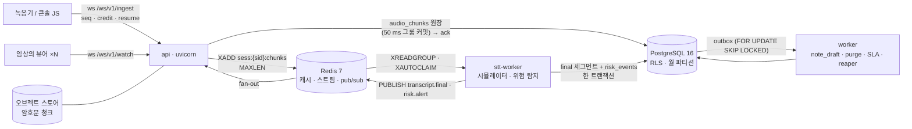

# chartwire

> **모든 데이터는 합성(SYNTHETIC)입니다 — 실제 환자 정보 없음.** API 키 없이 실행됩니다(STT 시뮬레이터 + 추출형 초안).
> 임상 사용 불가 — 연구/포트폴리오 구현입니다. STT 품질과 진료 노트 품질은 **평가하지 않았습니다**(합성 데이터, 시뮬레이터).

[](https://github.com/sokldjs554/chartwire/actions/workflows/ci.yml)
<!-- 라이브 데모 링크는 Render 배포가 실제로 동작하는 동안에만 여기에 둔다 (spec §12.2). -->

정신과 진료실 실시간 음성차팅의 밑바닥 — 무손실 WebSocket 스트리밍 프로토콜, 테넌시 격리, 파기 영수증, 실측된 운영 수치.
*The measured reliability & compliance layer under SOAPY-class psychiatric voice-charting products.*

## 1. SOAPY-class 제품이 30 → 300 의원으로 갈 때 백엔드가 감당해야 하는 8가지

음성차팅 제품(진료 녹음 → 전사 → SOAP 초안, 세션 종료 시 오디오 삭제, 의원 ~30곳)은 STT 모델 때문에 실패하지 않습니다. 아래에서 실패합니다.

| # | 문제 | chartwire 의 답 | 근거 |
|---|---|---|---|
| 1 | 진료실 Wi-Fi 가 끊겨 오디오가 유실·중복된다 | seq/ack/credit/resume/epoch 프로토콜, **ack = PostgreSQL 에 durable**, 링 버퍼 재전송, 손실·중복 0 을 속성·카오스 테스트로 고정 | [`docs/protocol.md`](docs/protocol.md), §2 표 ① |
| 2 | 09:00 에 30 의원이 동시에 시작 → STT 큐 적체 → 메모리 폭주 | credit 백프레셔(STT 지연·원장 적체 반영), `pause`, `MAXLEN` 스트림, 평평한 RSS 를 시나리오 B 로 측정 | §2 표 ①, [`docs/loadtest/results.md`](docs/loadtest/results.md) |
| 3 | 자살 사고 발화가 요약이 아니라 **초 단위**로 임상의에게 닿아야 한다 | stt-worker 트랜잭션 안의 결정론적 위험 탐지 → `risk.alert` 즉시 발행 → SLA 타이머·에스컬레이션 | [`docs/risk-detection.md`](docs/risk-detection.md) |
| 4 | LLM 초안이 아무도 말하지 않은 "리튬 복용 중"을 쓴다 | 문장마다 verbatim 근거 인용을 검증(8 규칙), 스키마에 진단/평가 필드 없음, 저커버리지면 abstain | [`docs/grounding.md`](docs/grounding.md) |
| 5 | 한 DB 에 30 의원 — `WHERE tenant_id` 하나 빠지면 유출 | PostgreSQL RLS + 단일 `chartwire_app` 역할(NOBYPASSRLS), 라우트×역할×테넌트 매트릭스 테스트, superuser 누출 대조 테스트 | [`docs/db/schema.md`](docs/db/schema.md), ADR-0001 |
| 6 | 환자가 동의를 철회 — 그러나 서명된 차트는 10년 보존해야 한다 | DEK crypto-shred + hard delete 파기 영수증 vs 기록 키로 봉인된 서명 노트(`legal_hold`, `retention_until`) | [`docs/consent-purge.md`](docs/consent-purge.md), ADR-0004 |
| 7 | "지난 6개월 이 환자의 불면 언급"을 수백만 세그먼트에서 100 ms 안에 | 월 파티션 + keyset, RLS 아래서 트라이그램 인덱스가 무시되는 플랜과 `SECURITY DEFINER` 해결, `terms[]` 인덱스 | [`docs/perf/README.md`](docs/perf/README.md), ADR-0005 |
| 8 | 라이브 세션을 떨어뜨리지 않고 배포하고, 파이프라인이 어디서 막혔는지 안다 | drain(`bye{drain}` → 원장 플러시 → 1012), 트랜잭션 아웃박스(리스/재시도/DLQ), 메트릭 28종, 런북 | [`docs/ops/runbook.md`](docs/ops/runbook.md) |

## 2. 실측 수치

세 표 모두 `scripts/readme_numbers.py --write` 가 `docs/{loadtest,perf,eval}/*.json` 에서 채웁니다(spec §11.4). 측정되지 않은 행은 **삭제**되며, 손으로 적은 숫자는 없습니다. 각 JSON 에는 `{seed, git_sha, generated_at, cpu, ram_gb, python, pg_version}` 헤더가 있습니다.

### ① 프로토콜 · 부하 — *same host, 4 vCPU, loopback, STT simulator, client-confounded*

api / worker / stt-worker / PostgreSQL / Redis / 부하 클라이언트가 **한 박스**에서 돌았고 클라이언트 시계로 잰 값입니다(서버만의 지연이 아님). 정의는 [`docs/loadtest/results.md`](docs/loadtest/results.md).

| 시나리오 | 항목 | 값 |
|---|---|---|
<!-- row:load.A.n50 -->| A N=50 (250 chunk/s) | ack p50 / p95 / p99 | <!-- num:load.A.n50.ack_p50_ms -->—<!-- /num --> / <!-- num:load.A.n50.ack_p95_ms -->—<!-- /num --> / <!-- num:load.A.n50.ack_p99_ms -->—<!-- /num --> ms |
<!-- /row -->
<!-- row:load.A.n50.e2e -->| A N=50 | final e2e p95 / alert e2e p95 / loss / dup | <!-- num:load.A.n50.final_e2e_p95_ms -->—<!-- /num --> ms / <!-- num:load.A.n50.alert_e2e_p95_ms -->—<!-- /num --> ms / <!-- num:load.A.n50.loss -->—<!-- /num --> / <!-- num:load.A.n50.dup -->—<!-- /num --> |
<!-- /row -->
<!-- row:load.A.n100 -->| A N=100 (500 chunk/s) | ack p50 / p95 / p99 | <!-- num:load.A.n100.ack_p50_ms -->—<!-- /num --> / <!-- num:load.A.n100.ack_p95_ms -->—<!-- /num --> / <!-- num:load.A.n100.ack_p99_ms -->—<!-- /num --> ms |
<!-- /row -->
<!-- row:load.A.n100.e2e -->| A N=100 | final e2e p95 / alert e2e p95 / loss / dup | <!-- num:load.A.n100.final_e2e_p95_ms -->—<!-- /num --> ms / <!-- num:load.A.n100.alert_e2e_p95_ms -->—<!-- /num --> ms / <!-- num:load.A.n100.loss -->—<!-- /num --> / <!-- num:load.A.n100.dup -->—<!-- /num --> |
<!-- /row -->
<!-- row:load.A.n200 -->| A N=200 (1,000 chunk/s) | ack p50 / p95 / p99 | <!-- num:load.A.n200.ack_p50_ms -->—<!-- /num --> / <!-- num:load.A.n200.ack_p95_ms -->—<!-- /num --> / <!-- num:load.A.n200.ack_p99_ms -->—<!-- /num --> ms |
<!-- /row -->
<!-- row:load.A.n200.e2e -->| A N=200 | final e2e p95 / alert e2e p95 / loss / dup | <!-- num:load.A.n200.final_e2e_p95_ms -->—<!-- /num --> ms / <!-- num:load.A.n200.alert_e2e_p95_ms -->—<!-- /num --> ms / <!-- num:load.A.n200.loss -->—<!-- /num --> / <!-- num:load.A.n200.dup -->—<!-- /num --> |
<!-- /row -->
<!-- row:load.A.n200.rate -->| A N=200 | 실측 chunk/s · credit 최솟값 | <!-- num:load.A.n200.chunks_per_s -->—<!-- /num --> chunk/s · <!-- num:load.A.n200.credit_min -->—<!-- /num --> |
<!-- /row -->
<!-- row:load.B -->| B SlowStt 400 ms, N=50 | credit → 0 도달 시각 · `pause` 수 · 스트림 길이 최대 · api RSS 기울기 · loss | <!-- num:load.B.credit_zero_at_s -->—<!-- /num --> s · <!-- num:load.B.pause_count -->—<!-- /num --> · <!-- num:load.B.stream_len_max -->—<!-- /num --> · <!-- num:load.B.api_rss_slope_mb_per_min -->—<!-- /num --> MB/min · <!-- num:load.B.loss -->—<!-- /num --> |
<!-- /row -->
<!-- row:load.C -->| C 느린 뷰어 20 %, N=100 | 녹음기 ack p95 · A 대비 변화 · 폐기된 partial | <!-- num:load.C.ack_p95_ms -->—<!-- /num --> ms · <!-- num:load.C.ack_p95_delta_pct -->—<!-- /num --> % · <!-- num:load.C.dropped_partials -->—<!-- /num --> |
<!-- /row -->
<!-- row:load.D -->| D 카오스 (소켓 kill 10 %/10 s · Redis flush · stt SIGSTOP 15 s), N=100 | resume 성공률 · superseded 종료 · 원장 rebuild · loss / dup | <!-- num:load.D.resume_success_pct -->—<!-- /num --> % · <!-- num:load.D.superseded_closes -->—<!-- /num --> · <!-- num:load.D.rebuild_count -->—<!-- /num --> · <!-- num:load.D.loss -->—<!-- /num --> / <!-- num:load.D.dup -->—<!-- /num --> |
<!-- /row -->
<!-- row:load.H -->| H 아웃박스 100 K 이벤트 · 워커 2 (1회 SIGKILL) | events/s · DLQ | <!-- num:load.H.events_per_s -->—<!-- /num --> ev/s · <!-- num:load.H.dlq_count -->—<!-- /num --> |
<!-- /row -->
<!-- row:load.E -->| E drain (선택) | loss · 재접속 p95 | <!-- num:load.E.loss -->—<!-- /num --> · <!-- num:load.E.reconnect_p95_ms -->—<!-- /num --> ms |
<!-- /row -->
<!-- row:eval.protocol -->| 프로토콜 속성 테스트 | hypothesis 예제 수 · 카오스 loss / dup | <!-- num:eval.protocol.hypothesis_examples -->—<!-- /num --> · <!-- num:eval.protocol.chaos_loss -->—<!-- /num --> / <!-- num:eval.protocol.chaos_dup -->—<!-- /num --> |
<!-- /row -->

### ② 쿼리 플랜 before(0006, RLS 만) / after(0007, 인덱스 + `search_segments()`)

<!-- row:perf.bulk -->합성 대량 데이터: 테넌트 <!-- num:perf.bulk.tenants -->—<!-- /num -->, 세션 <!-- num:perf.bulk.sessions -->—<!-- /num -->, `transcript_segments` <!-- num:perf.bulk.segments -->—<!-- /num --> 행(24개 월 파티션), 적재 <!-- num:perf.bulk.total_s -->—<!-- /num --> s, PostgreSQL <!-- num:perf.pg_version -->—<!-- /num -->. 실행계획 원본과 방법은 [`docs/perf/README.md`](docs/perf/README.md).
<!-- /row -->

| 쿼리 | before ms | after ms | 최상위 노드 (after) |
|---|---|---|---|
<!-- row:perf.Q1 -->| Q1 환자 타임라인 6개월 keyset | <!-- num:perf.Q1.before_ms -->—<!-- /num --> | <!-- num:perf.Q1.after_ms -->—<!-- /num --> | <!-- num:perf.Q1.after_plan -->—<!-- /num --> |
<!-- /row -->
<!-- row:perf.Q1a -->| Q1a 세션 재생 — 파티션 프루닝 없음 / 하한 / 상·하한 (after) | <!-- num:perf.Q1a_without.after_ms -->—<!-- /num --> / <!-- num:perf.Q1a_with.after_ms -->—<!-- /num --> / <!-- num:perf.Q1a_bounded.after_ms -->—<!-- /num --> | — | <!-- num:perf.Q1a_bounded.after_plan -->—<!-- /num --> |
<!-- /row -->
<!-- row:perf.Q1b -->| Q1b keyset vs offset 페이지네이션 (after) | <!-- num:perf.Q1b_keyset.after_ms -->—<!-- /num --> vs <!-- num:perf.Q1b_offset.after_ms -->—<!-- /num --> | — | <!-- num:perf.Q1b_keyset.after_plan -->—<!-- /num --> |
<!-- /row -->
<!-- row:perf.Q2a -->| Q2a 부분 문자열 검색, RLS 아래 `LIKE` (트라이그램 인덱스 **무시**) | <!-- num:perf.Q2a.before_ms -->—<!-- /num --> | <!-- num:perf.Q2a.after_ms -->—<!-- /num --> | <!-- num:perf.Q2a.after_plan -->—<!-- /num --> |
<!-- /row -->
<!-- row:perf.Q2b -->| Q2b 같은 검색, `SECURITY DEFINER search_segments()` | <!-- num:perf.Q2b.before_ms -->—<!-- /num --> | <!-- num:perf.Q2b.after_ms -->—<!-- /num --> | <!-- num:perf.Q2b.after_plan -->—<!-- /num --> |
<!-- /row -->
<!-- row:perf.Q2c -->| Q2c `terms[]` 배열 인덱스 (`@>`) | <!-- num:perf.Q2c.before_ms -->—<!-- /num --> | <!-- num:perf.Q2c.after_ms -->—<!-- /num --> | <!-- num:perf.Q2c.after_plan -->—<!-- /num --> |
<!-- /row -->
<!-- row:perf.Q2d -->| Q2d 함수 호출 wall time — text / term (after) | <!-- num:perf.Q2d_text.after_ms -->—<!-- /num --> / <!-- num:perf.Q2d_term.after_ms -->—<!-- /num --> | — | — |
<!-- /row -->
<!-- row:perf.Q3 -->| Q3 미확인 경보 (부분 인덱스) | <!-- num:perf.Q3.before_ms -->—<!-- /num --> | <!-- num:perf.Q3.after_ms -->—<!-- /num --> | <!-- num:perf.Q3.after_plan -->—<!-- /num --> |
<!-- /row -->
<!-- row:perf.Q4 -->| Q4 아웃박스 클레임 (`FOR UPDATE SKIP LOCKED`) | <!-- num:perf.Q4.before_ms -->—<!-- /num --> | <!-- num:perf.Q4.after_ms -->—<!-- /num --> | <!-- num:perf.Q4.after_plan -->—<!-- /num --> |
<!-- /row -->
<!-- row:perf.Q5 -->| Q5 RLS 오버헤드 (app vs superuser), Q1 / Q3 | <!-- num:perf.rls_overhead.before.q1_pct -->—<!-- /num --> % / <!-- num:perf.rls_overhead.before.q3_pct -->—<!-- /num --> % | <!-- num:perf.rls_overhead.after.q1_pct -->—<!-- /num --> % / <!-- num:perf.rls_overhead.after.q3_pct -->—<!-- /num --> % | — |
<!-- /row -->
<!-- row:perf.Q6 -->| Q6 환자 이름 정확 일치 (블라인드 인덱스) | <!-- num:perf.Q6.before_ms -->—<!-- /num --> | <!-- num:perf.Q6.after_ms -->—<!-- /num --> | <!-- num:perf.Q6.after_plan -->—<!-- /num --> |
<!-- /row -->

### ③ 안전 · 검증

| 항목 | 값 | 읽는 법 |
|---|---|---|
<!-- row:eval.risk_heldout -->| held-out 위험 발화 (n=<!-- num:eval.risk_heldout.n -->—<!-- /num -->) P / R / F1 | <!-- num:eval.risk_heldout.precision -->—<!-- /num --> / <!-- num:eval.risk_heldout.recall -->—<!-- /num --> / <!-- num:eval.risk_heldout.f1 -->—<!-- /num --> | 사전+범위 규칙의 안전망 수치. 임상 정확도 주장이 아님. 동결 세트(`FROZEN.txt`), 튜닝 안 함 |
<!-- /row -->
<!-- row:eval.risk_ingrammar -->| in-grammar 회귀 (200 스크립트) P / R | <!-- num:eval.risk_ingrammar.precision -->—<!-- /num --> / <!-- num:eval.risk_ingrammar.recall -->—<!-- /num --> | 구성상 높다 — 회귀 점검용 |
<!-- /row -->
<!-- row:eval.alert_latency -->| 경보 지연 (세그먼트 커밋 → 뷰어 `risk.alert`) p50 / p95 | <!-- num:eval.alert_latency.p50_ms -->—<!-- /num --> / <!-- num:eval.alert_latency.p95_ms -->—<!-- /num --> ms | 시나리오 A 안에서 측정, 같은 호스트 시계 |
<!-- /row -->
<!-- row:eval.purge -->| 파기 검증 — 잔존 행 / 오브젝트 / 키 · unwrap 실패 · 복호화 실패 · 영수증 검증 | <!-- num:eval.purge.residual_rows -->—<!-- /num --> / <!-- num:eval.purge.residual_objects -->—<!-- /num --> / <!-- num:eval.purge.residual_keys -->—<!-- /num --> · <!-- num:eval.purge.unwrap_failure_pct -->—<!-- /num --> % · <!-- num:eval.purge.decrypt_failure_pct -->—<!-- /num --> % · <!-- num:eval.purge.receipts_verified_pct -->—<!-- /num --> % | 실패율 100 % 가 목표(파기된 DEK 로는 열리지 않아야 함) |
<!-- /row -->
<!-- row:eval.rls -->| RLS / RBAC 교차 접근 시도 · 누출 | <!-- num:eval.rls.attempts -->—<!-- /num --> · <!-- num:eval.rls.leaks -->—<!-- /num --> | 라우트 × 역할 × 테넌트, `chartwire_app` 으로 접속 |
<!-- /row -->
<!-- row:eval.inject -->| 환각 주입 검출률 — fabricated / seq / diagnosis / number / drug / negation / speaker | <!-- num:eval.inject.fabricated.detection_rate -->—<!-- /num --> / <!-- num:eval.inject.seq.detection_rate -->—<!-- /num --> / <!-- num:eval.inject.diagnosis.detection_rate -->—<!-- /num --> / <!-- num:eval.inject.number.detection_rate -->—<!-- /num --> / <!-- num:eval.inject.drug.detection_rate -->—<!-- /num --> / <!-- num:eval.inject.negation.detection_rate -->—<!-- /num --> / <!-- num:eval.inject.speaker.detection_rate -->—<!-- /num --> | 클래스당 <!-- num:eval.inject.n_per_class -->—<!-- /num --> 변이, 오탐(false flag) <!-- num:eval.inject.false_flag_rate -->—<!-- /num --> |
<!-- /row -->
<!-- row:eval.paraphrase -->| 패러프레이즈 오거부율 | <!-- num:eval.paraphrase.false_rejection_rate -->—<!-- /num --> | 검증기가 정직한 바꿔쓰기를 얼마나 거부하는가 (잔여 원인: `docs/eval/README.md`) |
<!-- /row -->
<!-- row:eval.injection -->| 프롬프트 주입 누출 (<!-- num:eval.injection.n_sessions -->—<!-- /num --> 세션) | <!-- num:eval.injection.leaks -->—<!-- /num --> | 주입 발화가 초안 문장·근거로 새어 나온 수 |
<!-- /row -->
<!-- row:eval.grounding -->| 추출형 coverage · fact recall · abstain | <!-- num:eval.grounding.coverage -->—<!-- /num --> · <!-- num:eval.grounding.fact_recall -->—<!-- /num --> · <!-- num:eval.grounding.abstain_rate -->—<!-- /num --> | **coverage 1.0 은 구성상 당연**(인용문만으로 초안을 만든다); fact recall 이 정직한 수치 |
<!-- /row -->

## 3. 아키텍처와 WebSocket 프로토콜



상세: [`docs/architecture.md`](docs/architecture.md) (REDI / 마음편의점 재사용 문단 포함) · 규범 프로토콜 문서 [`docs/protocol.md`](docs/protocol.md).

**프로토콜 요약** — 녹음기는 12 B 헤더 + PCM 청크를 `seq` 순으로 보내고, 서버는 `audio_chunks` 행이 **PostgreSQL 에 커밋된 뒤에만** 누적 `ack{ack_seq, credit}` 를 보냅니다(ADR-0002: Redis 는 재구축 가능한 캐시). `credit` 은 STT 지연·원장 적체로 줄어들고 0 이면 `pause`; 녹음기는 `last_sent_seq − ack_seq ≤ credit` 을 지킵니다. 소켓이 끊기면 `hello{resume, last_sent_seq}` → `welcome{ack_seq, missing}` → 링 버퍼(150 청크)에서 재전송. 재접속마다 `epoch` 가 오르고 옛 연결의 프레임은 Lua 에서 펜싱되어 `bye{superseded}` + 4409. 배포 시 `bye{drain}` → 원장 플러시 → 1012 → 재접속. 코어(`ws/core.py`)는 sans-I/O 상태 기계로 hypothesis 가 두드립니다(예제 수는 표 ①).

## 4. 테넌시 · 검색

- **RLS + 단일 앱 역할** — 런타임 프로세스는 `chartwire_app`(`NOBYPASSRLS`) 으로만 접속하고 트랜잭션마다 `set_config('app.tenant_id', …, true)` 를 겁니다. 크로스 테넌트 작업(워커, 파기, 시드)은 테넌트를 순회합니다(ADR-0001). RLS 를 증명하는 테스트는 앱 역할로 접속하고, superuser 로 접속한 한 테스트가 **누출을 보여** 픽스처가 의미 있음을 증명합니다.
- **RLS 아래에서 트라이그램 인덱스가 무시된다** — `LIKE`/`similarity` 연산자는 `leakproof` 가 아니라 플래너가 RLS 정책 qual 보다 먼저 평가하지 못하고 인덱스를 버립니다. 해결은 `SECURITY DEFINER search_segments(q, mode)` 함수 안에서 테넌트 qual 을 직접 넣는 것; 표 ② 의 Q2a→Q2b 가 그 차이입니다(ADR-0005, [`docs/perf/README.md`](docs/perf/README.md)).
- **2음절 한국어 한계** — `pg_trgm` 은 3-gram 이라 "불면" 같은 2음절 질의는 인덱스 이득이 작습니다. 그래서 세그먼트마다 정규 증상어·약물 일반명·위험 범주를 `terms[]` 로 태깅하고 GIN `@>` 로 찾습니다(Q2c).
- 월 파티션(`transcript_segments`, `created_at = started_at + t_start_ms`), keyset 페이지네이션, 파티션 부모의 identity·unique 제약·`CONCURRENTLY` 함정은 [`docs/db/schema.md`](docs/db/schema.md).

## 5. 동의 · 파기 · 보존

동의 범위 4개(`recording`, `transcription`, `ai_drafting`, `search_index`)가 각 단계의 게이트입니다(범위 없으면 WS 4011 / REST `CW-4031`). 철회는 한 트랜잭션에서 철회 + 환자 단위 파기 작업 + 아웃박스 이벤트를 만들고, 라이브 세션에 `consent_revoked` 를 보냅니다. 파기 = 세션 DEK **crypto-shred** + 오디오·원장·세그먼트·검색·초안 **hard delete** → 검증(잔존 행/오브젝트/키, unwrap·복호화가 실패해야 통과) → 해시가 붙은 **파기 영수증**. 임상의가 **서명한** 노트만 의료법 진료기록으로 남습니다: 테넌트 기록 키(세션 DEK 와 독립)로 봉인, `legal_hold='medical_record'`, `retention_until = signed_at + 10년`, 근거 인용문을 문서 안에 내장해 자기완결(ADR-0004). 한계(WAL·백업·복제본에 남는 암호문)는 [`docs/consent-purge.md`](docs/consent-purge.md) 와 [`docs/limitations.md`](docs/limitations.md) 에 적었습니다.

## 6. SOAP 초안 어댑터 (thin, hedged)

- 출력 스키마(`notes/schema.py`)에 **Assessment · 진단 · 판정 필드가 없습니다**(`extra='forbid'`). A 는 콘솔의 "AI가 작성하지 않는 영역"에서 임상의만 씁니다.
- 문장마다 verbatim 인용 근거가 붙고, 결정론적 검증기 8 규칙(존재 · 정규화 일치 · 숫자/단위 · 약물명 · 부정 · 화자 · 판정 언어 · 주입 문구)이 문장을 `supported | unsupported` 로 나눕니다. unsupported 는 검토 전까지 서명 불가, 커버리지 0.85 미만이면 abstain.
- 기본 프로바이더는 **추출형**(키 없음): 발화를 인용해 초안을 만들므로 **Extractive coverage 1.0 은 구성상 당연**하고, 정직한 수치는 표 ③ 의 fact recall 입니다. 변이(7 클래스)·패러프레이즈·프롬프트 주입 세트가 검증기를 시험합니다.
- **Anthropic tier 는 미실행**입니다(오프라인 빌드, 키 없음). 어댑터·요청 형태·픽스처 재생 테스트만 있습니다 — [`docs/grounding.md`](docs/grounding.md), ADR-0003.

## 7. 위험 발화 경보

LLM 없는 결정론적 **고재현율 안전망**입니다: 한국어 사전(범주 4 × 등급 3)과 부정·가정·과거·3인칭·임상가 질문·관용구 범위 규칙. stt-worker 가 final 세그먼트를 커밋하는 **같은 트랜잭션**에서 `risk_events` 를 쓰고, 커밋 뒤 `risk.alert` 를 발행합니다. SLA 안에 확인되지 않으면 에스컬레이션 + `risk_unacked_over_sla` 게이지. 표 ③ 의 held-out 수치는 튜닝하지 않은 동결 세트의 값이며, **임상 정확도 주장이 아닙니다** — [`docs/risk-detection.md`](docs/risk-detection.md).

## 8. 운영

- **아웃박스** — 도메인 변경과 같은 트랜잭션에 이벤트 행; 워커가 테넌트별 `FOR UPDATE SKIP LOCKED` 로 클레임, 리스 만료 시 회수, 지수 백오프 ±20 %, 8회 실패 → DLQ → `chartwire outbox dlq replay`. 핸들러 효과와 `processed_events` 가 한 트랜잭션이라 **최소 1회 + 멱등** 이지 exactly-once 가 아닙니다.
- **drain** — SIGTERM → `/readyz` 503 → 녹음기에 `bye{drain}` → 원장 플러시 → 1012 → 클라이언트 resume; 워커는 클레임 중단 후 진행 중 핸들러를 끝냅니다.
- **메트릭**(`/metrics`), `/healthz`(드레인 중에도 200) · `/readyz`; 런북 3 시나리오(Redis 손실, 아웃박스 적체/DLQ, SLA 초과 경보) + 장애 모드 표 — [`docs/ops/runbook.md`](docs/ops/runbook.md), [`docs/ops/failure-modes.md`](docs/ops/failure-modes.md).
- **AWS CDK** — VPC · KMS · S3 · RDS PG16 · ElastiCache · ECS Fargate ×3 · ALB(idle 3600 s) · 알람 3개, cdk-nag 통과, 템플릿 커밋 + CI diff 0. **synth 만, 미배포** — [`docs/aws.md`](docs/aws.md).

## 9. 5분 실행법과 재현 명령

```bash
make dev-up      # PostgreSQL/Redis 기동 → 역할 생성 → 마이그레이션 → 데모 시드(합성)
make demo        # api + worker + stt-worker 한 프로세스 → http://127.0.0.1:8000/console (clinician@demo.clinic / demo1234!)
chartwire simulate --script s01 --speed 4 --drop-at 30s   # 프로토콜 준수 녹음기 + 뷰어, 30 s 에 소켓 강제 절단 → resume
```

콘솔 흐름(녹음 → 라이브 전사 · 위험 배너 → SOAP 초안 → 서명 → 동의 철회 → 파기 영수증 → "복호화 시도")은 [`docs/dev/e2e.md`](docs/dev/e2e.md).

| 숫자 | 재현 명령 | 산출물 |
|---|---|---|
| 표 ① A/B/C/D | `make loadtest-a loadtest-b loadtest-c loadtest-d` (유휴 박스, 직렬) | `docs/loadtest/{A,B,C,D}.json`, `results.md`, `docs/eval/alert_latency.json` |
| 표 ① H | `make loadtest-h` | `docs/loadtest/H.json` |
| 표 ② | `make bulk && make perf-study` | `docs/perf/summary.json`, `plans/*.json`, `leakproof.txt` |
| 표 ③ | `make eval` (+ RBAC 매트릭스·파기 스위트가 `var/eval/*.json` 을 씀) | `docs/eval/*.json` |
| README 갱신 | `make readme-numbers` (`scripts/readme_numbers.py --write`) | 마커 채움, 미측정 행 삭제 |
| 전체 테스트 | `make test-unit`, `make test-integration`(직렬, DB/Redis 필요), `make lint` | — |

## 10. AI 도구·에이전트로 개발한 방식

8개 작업 패키지(WP-A…H)를 동결된 계약(스펙 §15)에 대해 병렬로 진행하고, 통합자가 직렬로 스위트를 녹색으로 만든 뒤 유휴 박스에서 측정했습니다. 작업 패키지 표, 계약, 병합 게이트, 처음부터 알려 준 함정, 그리고 **테스트가 실제로 잡은 결함의 버그 저널**은 [`docs/AGENTS.md`](docs/AGENTS.md) 에 있습니다. 저널의 대표 항목: 재개 커서 교착(hypothesis 워크드 예시가 잡음), 원장 배처가 첫 행 뒤 영원히 대기하던 결함, 실패한 배치 뒤 `sessions.ack_seq` 가 구멍 위로 뛸 수 있던 이론상 손실 경로(SQL 검증으로 닫음), `COPY FROM` 이 RLS 테이블에서 거부되는 PostgreSQL 사실, SIGSTOP 에서 깨어난 옛 STT 소유자가 오프셋을 되돌리던 경합.

## 11. 한계와 미실행 항목 · 채용공고 매핑 · 기존 저장소

정직한 목록은 [`docs/limitations.md`](docs/limitations.md): STT 품질·노트 품질 미평가, 시뮬레이터·합성 데이터 상한, 단일 리전, 법적 보존 자동화는 플래그까지, Anthropic tier 미실행, 부하 수치는 클라이언트 혼입, Render 무료 티어 특성.

| 채용공고 항목 | 파일 |
|---|---|
| REST + WebSocket 실시간 | `src/chartwire/ws/`, `src/chartwire/api/`, `docs/protocol.md` |
| FastAPI / Python | `src/chartwire/api/app.py`, 순수 ASGI 미들웨어(`api/middleware.py`) |
| PostgreSQL 설계 · ORM · migration | `src/chartwire/db/`, `migrations/versions/0001..0007`, `docs/db/schema.md` |
| Redis | `src/chartwire/redis/`, `redis/scripts/*.lua`, `docs/protocol.md` |
| SQL 실행계획 분석 · 개선 | `src/chartwire/perf/`, `docs/perf/README.md`, ADR-0005 |
| AWS 배포 | `infra/cdk/`, `docs/aws.md` (synth 만) |
| 운영 | `src/chartwire/outbox/`, `src/chartwire/ops/`, `docs/ops/` |
| 헬스케어 · AI | `src/chartwire/notes/`, `src/chartwire/risk/`, `docs/grounding.md`, `docs/consent-purge.md` |
| AI 도구 · 에이전트 활용 개발 | `docs/AGENTS.md` |
| 더 나은 구조 고민 | `docs/adr/0001..0005` |

기존 저장소와의 관계: aegis-sql(SQL 안전 검사)과 DeFactoRule(규칙 기반 사실 검증)에서 "LLM 을 안전 경로에 두지 않고 결정론적 규칙으로 검증한다"는 원칙을 가져와 위험 탐지와 근거 검증기에 그대로 적용했습니다.
