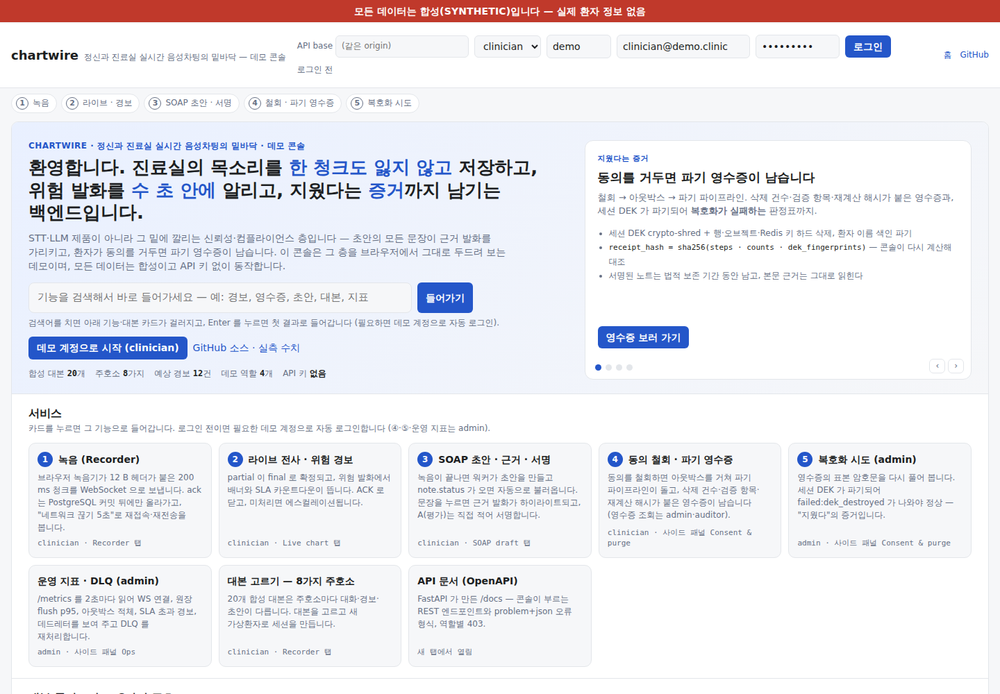
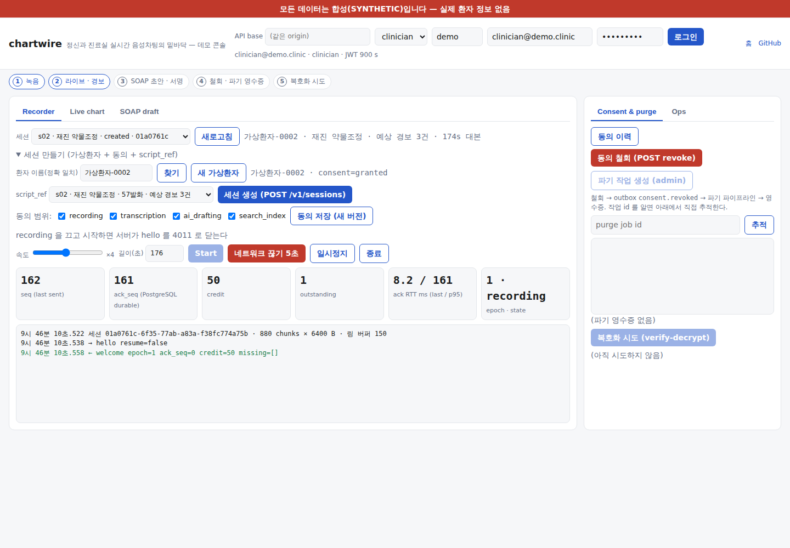
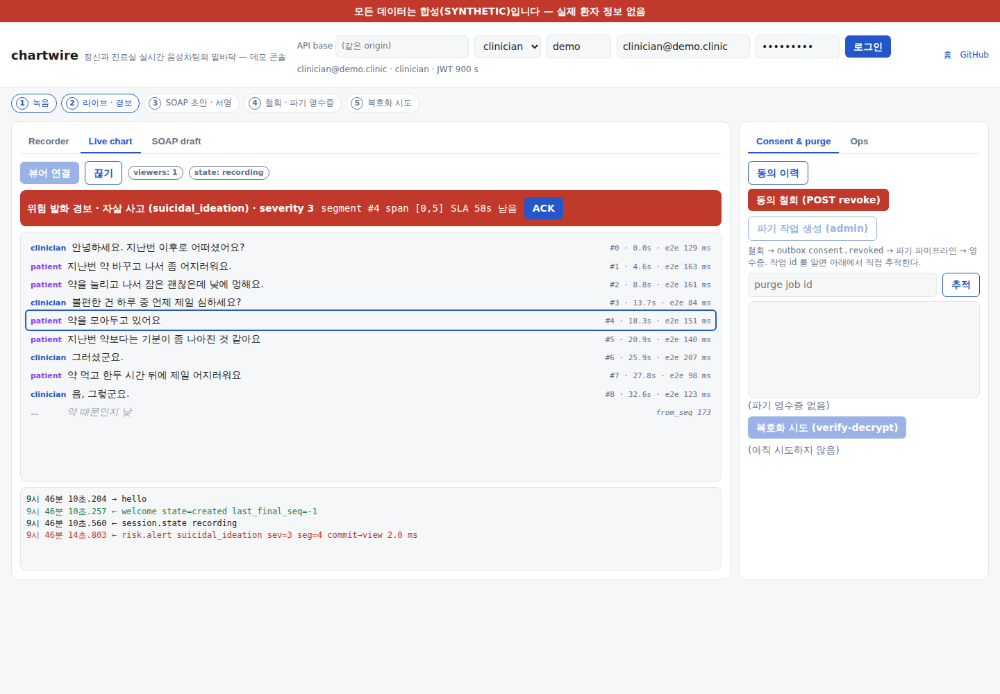
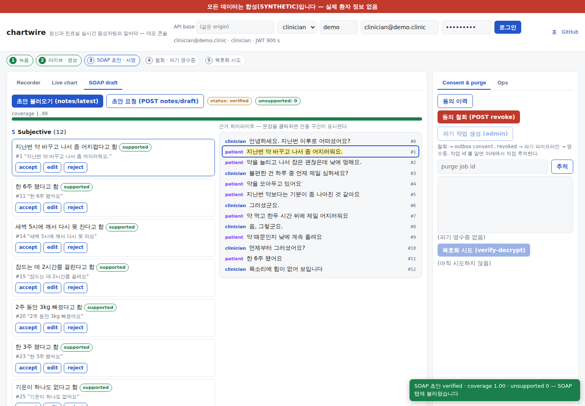
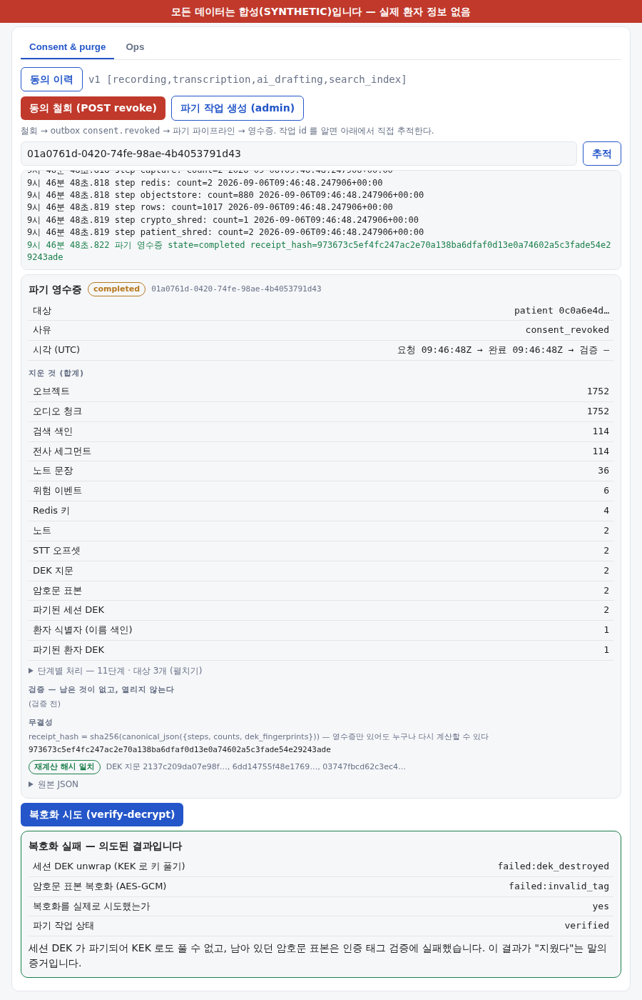
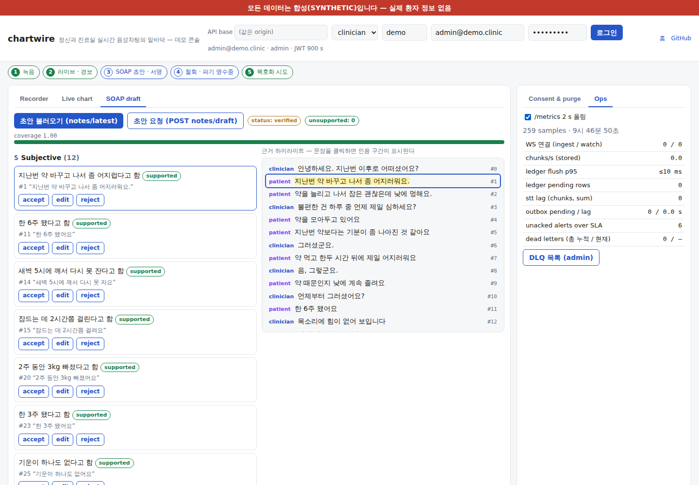
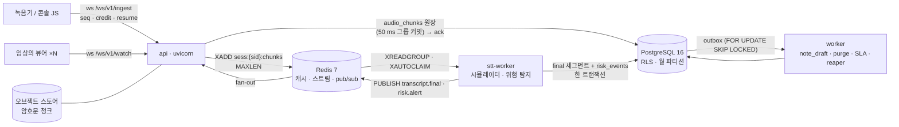

# chartwire

> **모든 데이터는 합성(SYNTHETIC)입니다 — 실제 환자 정보 없음.** API 키 없이 실행됩니다(STT 시뮬레이터 + 추출형 초안).
> 임상 사용 불가 — 연구/포트폴리오 구현입니다. STT 품질과 진료 노트 품질은 **평가하지 않았습니다**(합성 데이터, 시뮬레이터).

[](https://github.com/sokldjs554/chartwire/actions/workflows/ci.yml)
**공개 데모**: <https://chartwire.onrender.com> — 로그인 `demo` / `clinician@demo.clinic` / `demo1234!`
<!-- 링크는 배포가 실제로 동작하는 동안에만 둔다 (spec §12.2). 내려갔으면 이 두 줄을 지운다. -->

> 무료 인스턴스라 **첫 접속은 1~2분** 걸립니다(잠든 컨테이너를 깨우고 initdb·마이그레이션·데모 시드를 다시 돌립니다).
> 상태는 보존되지 않습니다 — 재배포하거나 다시 잠들면 서명한 노트도 파기 영수증도 사라집니다.
> **성능을 재는 대상이 아닙니다**: PostgreSQL·Redis·api·worker·stt-worker 가 한 컨테이너에서 0.1 vCPU 를 나눠 쓰므로
> 여기서 잰 지연은 아래 표 ①·② 와 비교할 수 없습니다. 이유와 대가는 [`docs/limitations.md`](docs/limitations.md) §8.
> 즉시 보여줘야 한다면 `docker compose up --build` 가 낫습니다(§10).

정신과 진료실 실시간 음성차팅의 밑바닥 — 무손실 WebSocket 스트리밍 프로토콜, 테넌시 격리, 파기 영수증, 실측된 운영 수치.
*The measured reliability & compliance layer under SOAPY-class psychiatric voice-charting products.*

## 1. SOAPY-class 제품이 30 → 300 의원으로 갈 때 백엔드가 감당해야 하는 8가지

음성차팅 제품(진료 녹음 → 전사 → SOAP 초안, 세션 종료 시 오디오 삭제, 의원 ~30곳)은 STT 모델 때문에 실패하지 않습니다. 아래에서 실패합니다.

| # | 문제 | chartwire 의 답 | 근거 |
|---|---|---|---|
| 1 | 진료실 Wi-Fi 가 끊겨 오디오가 유실·중복된다 | seq/ack/credit/resume/epoch 프로토콜, **ack = PostgreSQL 에 durable**, 링 버퍼 재전송, 손실·중복 0 을 속성·카오스 테스트로 고정 | [`docs/protocol.md`](docs/protocol.md), §2 표 ① |
| 2 | 09:00 에 30 의원이 동시에 시작 → STT 큐 적체 → 메모리 폭주 | credit 백프레셔(STT 지연·원장 적체 반영), `pause`, `MAXLEN` 스트림, 유한 큐와 api RSS 기울기를 시나리오 B 로 측정 | §2 표 ①, [`docs/loadtest/results.md`](docs/loadtest/results.md) |
| 3 | 자살 사고 발화가 요약이 아니라 **초 단위**로 임상의에게 닿아야 한다 | stt-worker 트랜잭션 안의 결정론적 위험 탐지 → `risk.alert` 즉시 발행 → SLA 타이머·에스컬레이션 | [`docs/risk-detection.md`](docs/risk-detection.md) |
| 4 | LLM 초안이 아무도 말하지 않은 "리튬 복용 중"을 쓴다 | 문장마다 verbatim 근거 인용을 검증(8 규칙), 스키마에 진단/평가 필드 없음, 저커버리지면 abstain | [`docs/grounding.md`](docs/grounding.md) |
| 5 | 한 DB 에 30 의원 — `WHERE tenant_id` 하나 빠지면 유출 | PostgreSQL RLS + 단일 `chartwire_app` 역할(NOBYPASSRLS), 라우트×역할×테넌트 매트릭스 테스트, superuser 누출 대조 테스트 | [`docs/db/schema.md`](docs/db/schema.md), ADR-0001 |
| 6 | 환자가 동의를 철회 — 그러나 서명된 차트는 10년 보존해야 한다 | DEK crypto-shred + hard delete 파기 영수증 vs 기록 키로 봉인된 서명 노트(`legal_hold`, `retention_until`) | [`docs/consent-purge.md`](docs/consent-purge.md), ADR-0004 |
| 7 | "지난 6개월 이 환자의 불면 언급"을 수백만 세그먼트에서 100 ms 안에 | 월 파티션 + keyset, RLS 아래서 트라이그램 인덱스가 무시되는 플랜과 `SECURITY DEFINER` 해결, `terms[]` 인덱스 | [`docs/perf/README.md`](docs/perf/README.md), ADR-0005 |
| 8 | 라이브 세션을 떨어뜨리지 않고 배포하고, 파이프라인이 어디서 막혔는지 안다 | drain(`bye{drain}` → 원장 플러시 → 1012), 트랜잭션 아웃박스(리스/재시도/DLQ), `/metrics`, 런북 | [`docs/ops/runbook.md`](docs/ops/runbook.md) |

## 2. 실측 수치

세 표 모두 `scripts/readme_numbers.py --write` 가 `docs/{loadtest,perf,eval}/*.json` 에서 채웁니다(spec §11.4). 측정되지 않은 행은 **삭제**되며, 손으로 적은 숫자는 없습니다. 각 JSON 에는 `{seed, git_sha, generated_at, cpu, ram_gb, python, pg_version}` 헤더가 있습니다 — `git_sha` 가 무엇을 뜻하는지는 §2 끝의 **출처(provenance)** 문단을 읽어 주세요.

### ① 프로토콜 · 부하 — *same host, 4 vCPU, loopback, STT simulator, client-confounded*

api / worker / stt-worker / PostgreSQL / Redis / 부하 클라이언트가 **한 박스**에서 돌았고 클라이언트 시계로 잰 값입니다(서버만의 지연이 아님). 정의는 [`docs/loadtest/results.md`](docs/loadtest/results.md).

| 시나리오 | 항목 | 값 |
|---|---|---|
<!-- row:load.A.n50 -->| A N=50 (250 chunk/s) | ack p50 / p95 / p99 | <!-- num:load.A.n50.ack_p50_ms -->81<!-- /num --> / <!-- num:load.A.n50.ack_p95_ms -->223<!-- /num --> / <!-- num:load.A.n50.ack_p99_ms -->262<!-- /num --> ms |
<!-- /row -->
<!-- row:load.A.n50.e2e -->| A N=50 | final e2e p95 / alert e2e p95 / loss / dup | <!-- num:load.A.n50.final_e2e_p95_ms -->208<!-- /num --> ms / <!-- num:load.A.n50.alert_e2e_p95_ms -->56<!-- /num --> ms / <!-- num:load.A.n50.loss -->0<!-- /num --> / <!-- num:load.A.n50.dup -->0<!-- /num --> |
<!-- /row -->
<!-- row:load.A.n100 -->| A N=100 (500 chunk/s) | ack p50 / p95 / p99 | <!-- num:load.A.n100.ack_p50_ms -->182<!-- /num --> / <!-- num:load.A.n100.ack_p95_ms -->449<!-- /num --> / <!-- num:load.A.n100.ack_p99_ms -->1216<!-- /num --> ms |
<!-- /row -->
<!-- row:load.A.n100.e2e -->| A N=100 | final e2e p95 / alert e2e p95 / loss / dup | <!-- num:load.A.n100.final_e2e_p95_ms -->893<!-- /num --> ms / <!-- num:load.A.n100.alert_e2e_p95_ms -->65<!-- /num --> ms / <!-- num:load.A.n100.loss -->0<!-- /num --> / <!-- num:load.A.n100.dup -->0<!-- /num --> |
<!-- /row -->
<!-- row:load.A.n200 -->| A N=200 (목표 1,000 chunk/s — **무릎**) | ack p50 / p95 / p99 | <!-- num:load.A.n200.ack_p50_ms -->4512<!-- /num --> / <!-- num:load.A.n200.ack_p95_ms -->9036<!-- /num --> / <!-- num:load.A.n200.ack_p99_ms -->9576<!-- /num --> ms |
<!-- /row -->
<!-- row:load.A.n200.e2e -->| A N=200 | final e2e p95 / alert e2e p95 / loss / dup | <!-- num:load.A.n200.final_e2e_p95_ms -->8879<!-- /num --> ms / <!-- num:load.A.n200.alert_e2e_p95_ms -->230<!-- /num --> ms / <!-- num:load.A.n200.loss -->0<!-- /num --> / <!-- num:load.A.n200.dup -->0<!-- /num --> |
<!-- /row -->
<!-- row:load.A.n200.rate -->| A N=200 | **실측** chunk/s · credit 최솟값 | <!-- num:load.A.n200.chunks_per_s -->790<!-- /num --> chunk/s · <!-- num:load.A.n200.credit_min -->17<!-- /num --> |
<!-- /row -->
<!-- row:load.A.n200.sessions -->| A N=200 | **끝까지 간 세션 / 시도** | <!-- num:load.A.n200.sessions_ended -->158<!-- /num --> / <!-- num:load.A.n200.sessions_attempted -->200<!-- /num --> |
<!-- /row -->
<!-- row:load.A.n200.shed -->| A N=200 | 청크를 한 개도 못 보낸 세션 (`clients.outcomes.running`) | <!-- num:load.A.n200.sessions_never_started -->42<!-- /num --> |
<!-- /row -->
<!-- row:load.B -->| B SlowStt 400 ms, N=50 | credit → 0 도달 시각 · `pause` 수 · 스트림 길이 최대 · api RSS 기울기 · loss | <!-- num:load.B.credit_zero_at_s -->39.5<!-- /num --> s · <!-- num:load.B.pause_count -->90<!-- /num --> · <!-- num:load.B.stream_len_max -->301<!-- /num --> · <!-- num:load.B.api_rss_slope_mb_per_min -->2.47<!-- /num --> MB/min · <!-- num:load.B.loss -->0<!-- /num --> |
<!-- /row -->
<!-- row:load.C -->| C 느린 뷰어 20 %, N=100 | 녹음기 ack p95 · A 대비 변화 · 폐기된 partial † | <!-- num:load.C.ack_p95_ms -->356<!-- /num --> ms · <!-- num:load.C.ack_p95_delta_pct -->-20.9<!-- /num --> % · <!-- num:load.C.dropped_partials -->0<!-- /num --> |
<!-- /row -->
<!-- row:load.D -->| D 카오스 (소켓 kill 10 %/10 s · Redis flush · stt SIGSTOP 15 s), N=100 | resume 성공률 · superseded 종료 · 원장 rebuild · loss / dup | <!-- num:load.D.resume_success_pct -->100.0<!-- /num --> % · <!-- num:load.D.superseded_closes -->0<!-- /num --> · <!-- num:load.D.rebuild_count -->57<!-- /num --> · <!-- num:load.D.loss -->0<!-- /num --> / <!-- num:load.D.dup -->0<!-- /num --> |
<!-- /row -->
<!-- row:load.H -->| H 아웃박스 100 K 이벤트 · 워커 2 (1회 SIGKILL) | events/s · DLQ | <!-- num:load.H.events_per_s -->413<!-- /num --> ev/s · <!-- num:load.H.dlq_count -->0<!-- /num --> |
<!-- /row -->
<!-- row:eval.protocol -->| 프로토콜 속성 테스트 | hypothesis 예제 수 · 카오스 loss / dup | <!-- num:eval.protocol.hypothesis_examples -->2300<!-- /num --> · <!-- num:eval.protocol.chaos_loss -->0<!-- /num --> / <!-- num:eval.protocol.chaos_dup -->0<!-- /num --> |
<!-- /row -->


<!-- row:load.A.knee -->**무릎(knee)을 숨기지 않습니다.** ack p95 는 N=50 <!-- num:load.A.n50.ack_p95_ms -->223<!-- /num --> ms → N=100 <!-- num:load.A.n100.ack_p95_ms -->449<!-- /num --> ms 까지 완만하다가 N=200 에서 <!-- num:load.A.n200.ack_p95_ms -->9036<!-- /num --> ms 로 무너지고, 의도한 1,000 chunk/s 대신 <!-- num:load.A.n200.chunks_per_s -->790<!-- /num --> chunk/s 만 나옵니다. 병목은 저장소가 아니라 **파이썬 프로세스 하나가 코어 하나를 넘지 못하는 것**입니다(api 이벤트 루프와 stt-worker 가 각자 프로세스 CPU 천장에 붙고, PostgreSQL·Redis 는 한가합니다 — `docs/loadtest/results.md` 의 자원 표, 코어 핀을 풀어도 같음). 그 지점에서도 `loss` <!-- num:load.A.n200.loss -->0<!-- /num --> · `dup` <!-- num:load.A.n200.dup -->0<!-- /num --> 이고 credit 최솟값은 <!-- num:load.A.n200.credit_min -->17<!-- /num --> 입니다 — 다만 **이 `loss` 는 "시작된 세션이 보낸 청크의 원장"에 대한 값**입니다. 같은 실행에서 끝까지 간 세션은 <!-- num:load.A.n200.sessions_ended -->158<!-- /num --> / <!-- num:load.A.n200.sessions_attempted -->200<!-- /num --> 이고, 나머지 세션은 청크를 **한 개도 보내지 못한 채** 끝났습니다(`hello` 가 시간 안에 돌아오지 않았습니다 — 위 표의 마지막 A 행). 실측 <!-- num:load.A.n200.chunks_per_s -->790<!-- /num --> chunk/s 는 끝까지 간 세션 수 × 세션당 5 chunk/s 이고, 목표 1,000 과의 차이는 세션당 속도가 아니라 **세션 유실**입니다. 즉 **이 박스의 무릎에서는 시작된 세션을 떨어뜨리지 않고 느려지지만, 새 세션은 받지 못합니다** — "떨어뜨리지 않는다" 를 시스템 전체에 대한 주장으로 읽으면 안 됩니다. 수평 확장(api 다중 프로세스 · stt-worker 다중 인스턴스)은 **미실행**이고, 스펙이 시나리오 E 로 남겨 둔 drain 측정도 실행하지 않았습니다.
<!-- /row -->

† **C 의 "폐기된 partial 0" 은 구성상 도달할 수 없는 값입니다.** 세션당 청크 300개에 partial 은 두 청크에 하나이므로 뷰어가 받는 partial 은 최대 150개인데 `partial_q` 는 256칸이고, "느린" 뷰어의 메시지당 200 ms(= 5 msg/s)는 실제 도착률 ≈ 2.9 msg/s 보다 빠릅니다 — 큐가 찰 수 없으므로 drop-oldest 경로가 **한 번도 실행되지 않았다**는 뜻이고, 격리가 동작한다는 근거가 아닙니다. drop-oldest 동작 자체는 `tests/ws/test_watch_queues.py` 가 고정합니다([`docs/limitations.md`](docs/limitations.md) §3).

### ② 쿼리 플랜 before(0006, RLS 만) / after(0007, 인덱스 + `search_segments()`)

<!-- row:perf.bulk -->합성 대량 데이터: 테넌트 <!-- num:perf.bulk.tenants -->8<!-- /num -->, 세션 <!-- num:perf.bulk.sessions -->20000<!-- /num -->, `transcript_segments` <!-- num:perf.bulk.segments -->2000000<!-- /num --> 행(24개 월 파티션), 적재 <!-- num:perf.bulk.total_s -->108<!-- /num --> s, PostgreSQL <!-- num:perf.pg_version -->16.13 (Ubuntu 16.13-0ubuntu0.24.04.1)<!-- /num -->. 실행계획 원본과 방법은 [`docs/perf/README.md`](docs/perf/README.md).
<!-- /row -->

| 쿼리 | before ms | after ms | 최상위 노드 (after) |
|---|---|---|---|
<!-- row:perf.Q1 -->| Q1 환자 타임라인 6개월 keyset | <!-- num:perf.Q1.before_ms -->27.4<!-- /num --> | <!-- num:perf.Q1.after_ms -->2.5<!-- /num --> | <!-- num:perf.Q1.after_plan -->Limit<!-- /num --> |
<!-- /row -->
<!-- row:perf.Q1a -->| Q1a 세션 재생 — 파티션 프루닝 없음 / 하한 / 상·하한 (after) | <!-- num:perf.Q1a_without.after_ms -->2.6<!-- /num --> / <!-- num:perf.Q1a_with.after_ms -->1.2<!-- /num --> / <!-- num:perf.Q1a_bounded.after_ms -->1.0<!-- /num --> | — | <!-- num:perf.Q1a_bounded.after_plan -->Limit<!-- /num --> |
<!-- /row -->
<!-- row:perf.Q1b -->| Q1b keyset vs offset 페이지네이션 (after) | <!-- num:perf.Q1b_keyset.after_ms -->3.1<!-- /num --> vs <!-- num:perf.Q1b_offset.after_ms -->2.9<!-- /num --> | — | <!-- num:perf.Q1b_keyset.after_plan -->Limit<!-- /num --> |
<!-- /row -->
<!-- row:perf.Q2a -->| Q2a 2음절 `%불면%` as app — 트라이그램(3-gram)이 만들어지지 않아 GIN 사용 불가 | <!-- num:perf.Q2a.before_ms -->40.1<!-- /num --> | <!-- num:perf.Q2a.after_ms -->44.6<!-- /num --> | <!-- num:perf.Q2a.after_plan -->Limit<!-- /num --> |
<!-- /row -->
<!-- row:perf.Q2b -->| Q2b 3음절 `%불면증%` as app (RLS) — GIN 이 있어도 **미사용**(`texticlike` 가 leakproof 아님) | <!-- num:perf.Q2b.before_ms -->40.1<!-- /num --> | <!-- num:perf.Q2b.after_ms -->41.2<!-- /num --> | <!-- num:perf.Q2b.after_plan -->Limit<!-- /num --> |
<!-- /row -->
<!-- row:perf.Q2c -->| Q2c 같은 쿼리 as owner (RLS 면제 = `SECURITY DEFINER` 실행 컨텍스트) — `ix_search_text_trgm` Bitmap Index Scan | <!-- num:perf.Q2c.before_ms -->44.3<!-- /num --> | <!-- num:perf.Q2c.after_ms -->6.0<!-- /num --> | <!-- num:perf.Q2c.after_plan -->Limit<!-- /num --> |
<!-- /row -->
<!-- row:perf.Q2d -->| Q2d `search_segments()` wall time as app — `('불면증','text')` / `('불면','term')` | <!-- num:perf.Q2d_text.after_ms -->5.8<!-- /num --> / <!-- num:perf.Q2d_term.after_ms -->22.1<!-- /num --> | — | — |
<!-- /row -->
<!-- row:perf.Q3 -->| Q3 미확인 경보 (부분 인덱스) | <!-- num:perf.Q3.before_ms -->1.6<!-- /num --> | <!-- num:perf.Q3.after_ms -->0.7<!-- /num --> | <!-- num:perf.Q3.after_plan -->Limit<!-- /num --> |
<!-- /row -->
<!-- row:perf.Q4 -->| Q4 아웃박스 클레임 (`FOR UPDATE SKIP LOCKED`) | <!-- num:perf.Q4.before_ms -->207.1<!-- /num --> | <!-- num:perf.Q4.after_ms -->0.4<!-- /num --> | <!-- num:perf.Q4.after_plan -->Limit<!-- /num --> |
<!-- /row -->
<!-- row:perf.Q5 -->| Q5 RLS 오버헤드 (app vs superuser), Q1 / Q3 | <!-- num:perf.rls_overhead.before.q1_pct -->+14.9<!-- /num --> % / <!-- num:perf.rls_overhead.before.q3_pct -->+3.8<!-- /num --> % | <!-- num:perf.rls_overhead.after.q1_pct -->+19.0<!-- /num --> % / <!-- num:perf.rls_overhead.after.q3_pct -->-19.2<!-- /num --> % | — |
<!-- /row -->
<!-- row:perf.Q6 -->| Q6 환자 이름 정확 일치 (블라인드 인덱스) | <!-- num:perf.Q6.before_ms -->0.3<!-- /num --> | <!-- num:perf.Q6.after_ms -->0.3<!-- /num --> | <!-- num:perf.Q6.after_plan -->Result<!-- /num --> |
<!-- /row -->


Q2 는 **같은 SQL 이 실행 역할에 따라 다른 플랜을 받는다**는 것을 보여주는 세 실행입니다: Q2b(app, RLS 적용)는 GIN 을 쓰지 못하고, Q2c(owner, RLS 면제)는 `ix_search_text_trgm` 을 Bitmap Index Scan 으로 쓰며, Q2d 는 그 owner 컨텍스트를 `SECURITY DEFINER search_segments()` 로 감싸 **앱 역할에서** 같은 속도를 냅니다. 플랜 원본은 `docs/perf/plans/q2b_after.json` · `q2c_after.json`, 전체 이야기는 [`docs/perf/README.md`](docs/perf/README.md) §Q2.

### ③ 안전 · 검증

| 항목 | 값 | 읽는 법 |
|---|---|---|
<!-- row:eval.risk_heldout -->| held-out 위험 발화 (n=<!-- num:eval.risk_heldout.n -->300<!-- /num -->) P / R / F1 | <!-- num:eval.risk_heldout.precision -->0.76<!-- /num --> / <!-- num:eval.risk_heldout.recall -->0.57<!-- /num --> / <!-- num:eval.risk_heldout.f1 -->0.65<!-- /num --> | 사전+범위 규칙의 안전망 수치. 임상 정확도 주장이 아님. 동결 세트(`FROZEN.txt`), 튜닝 안 함 |
<!-- /row -->
<!-- row:eval.risk_ingrammar -->| in-grammar 회귀 (<!-- num:eval.risk_ingrammar.n_scripts -->200<!-- /num --> 스크립트) P / R | <!-- num:eval.risk_ingrammar.precision -->1.00<!-- /num --> / <!-- num:eval.risk_ingrammar.recall -->1.00<!-- /num --> | 구성상 높다 — 회귀 점검용 |
<!-- /row -->
<!-- row:eval.alert_latency -->| 경보 지연 (세그먼트 커밋 → 뷰어 `risk.alert`) p50 / p95 | <!-- num:eval.alert_latency.p50_ms -->47<!-- /num --> / <!-- num:eval.alert_latency.p95_ms -->230<!-- /num --> ms | 시나리오 A 안에서 측정, 같은 호스트 시계 |
<!-- /row -->
<!-- row:eval.purge -->| 파기 검증 — 잔존 행 / 오브젝트 / 키 · unwrap 실패 · 복호화 실패 · 영수증 검증 | <!-- num:eval.purge.residual_rows -->0<!-- /num --> / <!-- num:eval.purge.residual_objects -->0<!-- /num --> / <!-- num:eval.purge.residual_keys -->0<!-- /num --> · <!-- num:eval.purge.unwrap_failure_pct -->100<!-- /num --> % · <!-- num:eval.purge.decrypt_failure_pct -->100<!-- /num --> % · <!-- num:eval.purge.receipts_verified_pct -->100<!-- /num --> % | 실패율 100 % 가 목표(파기된 DEK 로는 열리지 않아야 함) |
<!-- /row -->
<!-- row:eval.rls -->| RLS / RBAC 교차 접근 시도 · 누출 | <!-- num:eval.rls.attempts -->252<!-- /num --> · <!-- num:eval.rls.leaks -->0<!-- /num --> | 라우트 × 역할 × 테넌트, `chartwire_app` 으로 접속 |
<!-- /row -->
<!-- row:eval.inject -->| 환각 주입 검출률 — fabricated / seq / diagnosis / number / drug / negation / speaker | <!-- num:eval.inject.fabricated.detection_rate -->1.00<!-- /num --> / <!-- num:eval.inject.seq.detection_rate -->1.00<!-- /num --> / <!-- num:eval.inject.diagnosis.detection_rate -->1.00<!-- /num --> / <!-- num:eval.inject.number.detection_rate -->1.00<!-- /num --> / <!-- num:eval.inject.drug.detection_rate -->1.00<!-- /num --> / <!-- num:eval.inject.negation.detection_rate -->0.99<!-- /num --> / <!-- num:eval.inject.speaker.detection_rate -->1.00<!-- /num --> | 클래스당 <!-- num:eval.inject.n_per_class -->200<!-- /num --> 변이, 오탐(false flag) <!-- num:eval.inject.false_flag_rate -->0.000<!-- /num --> — **구성상 높다**: 변이를 검증기와 **같은** 사전·정규식(`DRUGS`/`DIAGNOSES`, `NEGATION_RE`, `NUMERIC_UNIT_RE`)에서 뽑으므로 규칙 배선의 회귀 점검이지 사전 밖 표현에 대한 일반화 근거가 아니다 |
<!-- /row -->
<!-- row:eval.paraphrase -->| 패러프레이즈 오거부율 | <!-- num:eval.paraphrase.false_rejection_rate -->0.011<!-- /num --> | 검증기가 정직한 바꿔쓰기를 얼마나 거부하는가 (잔여 원인: `docs/eval/README.md`) |
<!-- /row -->
<!-- row:eval.injection -->| 프롬프트 주입 누출 (<!-- num:eval.injection.n_sessions -->20<!-- /num --> 세션) | <!-- num:eval.injection.leaks -->0<!-- /num --> | 주입 발화가 초안 문장·근거로 새어 나온 수. **구성상 낮다** — 규칙 8 정규식을 §9.5 주입 6문장의 표면형까지 넓혔고 평가가 재생하는 문장이 정확히 그 6문장이다. 위험 탐지와 달리 **held-out 주입 세트가 없다**; 회귀 점검용([`docs/grounding.md`](docs/grounding.md) §7) |
<!-- /row -->
<!-- row:eval.grounding -->| 추출형 coverage · fact recall · abstain | <!-- num:eval.grounding.coverage -->1.00<!-- /num --> · <!-- num:eval.grounding.fact_recall -->0.58<!-- /num --> · <!-- num:eval.grounding.abstain_rate -->0.00<!-- /num --> | **coverage 1.0 은 구성상 당연**(인용문만으로 초안을 만든다); fact recall 이 정직한 수치 |
<!-- /row -->


### 왜 이 숫자를 믿어도 되는가 / 믿으면 안 되는가

**믿어도 되는 쪽** — 표의 모든 값은 코드가 쓴 JSON(`docs/{loadtest,perf,eval}/*.json`)에서 `scripts/readme_numbers.py` 가 옮긴 것입니다. 손으로 적은 숫자는 없고, 측정되지 않은 행은 지워집니다. CI 의 `frozen-artifacts` 잡이 `--check` 로 문서와 JSON 이 어긋나면 빨간불을 냅니다. 각 리포트에는 시드·git sha·CPU·RAM·PostgreSQL 버전 헤더가 있고, 부하 리포트에는 어느 DB 에서 쟀는지와 **DB 대조**(세션 상태, `stt_offsets`, 세그먼트 seq 연속성, 원장 대비 loss)가 같이 들어 있습니다. 재현 명령은 §10 표에 있습니다.

**출처(provenance) — `git_sha` 는 "측정을 실행한 시점의 HEAD" 이지 "그 코드가 담긴 커밋" 이 아니었습니다.** 커밋된 리포트는 모두 `3162091`(부하 H 는 `bd9b2df`, perf 는 `a66b607`)을 적고 있지만, 그 숫자를 낸 코드(561-stem 위험 사전, redis 풀 상한 512, `stt:active` 잔여 세션 정리)는 **다음 커밋 `d66d051` 에서야 커밋됐습니다** — 측정 당시 작업 트리가 더러웠고 헤더가 그것을 알려 주지 않았습니다. 계산형 평가 6종(`risk_heldout`, `risk_ingrammar`, `grounding`, `inject`, `injection`, `paraphrase`)은 `d66d051` 의 코드로 다시 돌려 **헤더를 뺀 본문이 바이트 단위로 같음**을 확인했으므로 표 ③ 의 값은 배포된 코드의 값입니다. **부하 리포트(A/B/C/D)는 재실행 없이는 같은 확인을 할 수 없고, 이 리뷰에서 재실행하지 않았습니다** — `docs/loadtest/*.json` 의 sha 가 가리키는 커밋을 체크아웃해 `make loadtest-a` 를 돌리면 풀 상한 수정이 없는 코드가 나오므로 값이 재현되지 않습니다. 재현하려면 `d66d051` 이후를 쓰세요. 재발 방지로 `eval/report.py::git_sha()` 는 이제 더러운 트리에 `-dirty` 를 붙입니다([`docs/limitations.md`](docs/limitations.md) §3).

**믿으면 안 되는 쪽** — ① **같은 호스트**: api·worker·stt-worker·PostgreSQL·Redis·부하 클라이언트가 4 vCPU 한 박스에서 CPU 를 나눠 씁니다. 분리된 인프라의 값이 아닙니다. ② **클라이언트 혼입**: ack·e2e 지연은 클라이언트 시계로 잰 값이라 서버만의 지연이 아니고 부하 클라이언트 자신의 부하도 들어 있습니다. ③ **합성 상한**: 전사는 STT 시뮬레이터, 문장은 문법으로 만든 합성 한국어, 대량 데이터는 벌크 로더의 분포입니다 — 실제 진료 음성·실제 말뭉치에서의 값이 아니고, 그래서 STT 품질과 노트 품질은 **평가하지 않았다**고 적습니다. ④ **실행 간 편차**: 같은 빌드에서도 N=100 의 ack p95 는 실행마다 눈에 띄게 흔들렸습니다. 표 ① 의 C 행 변화율처럼 그 편차보다 작은 차이는 "느린 뷰어의 결합이 **관측되지 않았다**"까지만 읽어야 합니다. ⑤ **held-out 위험 탐지 P/R 은 안전망 지표**입니다 — 동결된 held-out 세트에 대한 규칙의 성능이고, 임상 정확도 주장이 아닙니다(§8). ⑥ **표 ③ 의 세 행은 자기 테스트 세트에 맞춰진 값**이라 회귀 점검으로만 읽어야 합니다: in-grammar 위험 회귀(같은 문법), 환각 주입 검출률(변이를 검증기의 사전·정규식에서 뽑음), 프롬프트 주입 누출(규칙 8 정규식이 그 6문장의 표면형을 포함하도록 넓혀졌고 held-out 주입 세트가 없음). 위험 탐지에만 held-out 세트가 있습니다. 전체 목록은 [`docs/limitations.md`](docs/limitations.md).

## 3. 5분 데모 (모두 합성 데이터)


*한 세션의 전 과정입니다(약 45초, 12 fps): 홈 화면 → 로그인 → 세션 생성(재진 약물조정 대본) → 녹음 시작(스크립트 재생 4배속) → 라이브 전사와 위험 경보 → 근거가 하이라이트된 SOAP 초안 → 동의 철회 → 파기 영수증 → **복호화 시도 실패**. 연출이 아니라 Playwright 가 실제로 띄운 서버(`make demo`)를 몰아서 녹화한 화면이고, 등속입니다. 화면 위 **SYNTHETIC** 배너는 모든 장면에 그대로 있습니다.*

콘솔을 처음 열면 **홈 화면**이 먼저 나옵니다 — 환영 문구, 기능 검색(검색어를 치고 Enter 를 누르면 그 기능으로 들어갑니다), 배너, 서비스 카드 8장, 주호소별 대본 카드, 5분 투어 5단계, 역할별 데모 계정, 무료 인스턴스 주의사항. 카드·배너·검색으로 들어가면 필요한 데모 계정으로 자동 로그인되고, 헤더의 "홈"으로 언제든 돌아옵니다. 헤더 아래의 단계 표시가 진행을 따라갑니다. 대본 20개는 8가지 주호소(초진 우울 · 재진 약물조정 · 불안/공황 · 불면 · 성인 ADHD 추적 · 적응/스트레스 · 알코올 · 강박)를 순환 배정한 것이라 어느 것을 골라도 **질문·답·계획·경보·초안이 다릅니다**(`synth/grammar.py`, [`docs/dev/e2e.md`](docs/dev/e2e.md) §6).



| | |
|---|---|
|  |  |
| **① 녹음** — 브라우저 녹음기가 12 B 헤더 + PCM 청크를 보내고 `ack{ack_seq, credit}` 을 받습니다. ack 는 `audio_chunks` 가 **PostgreSQL 에 커밋된 뒤에만** 옵니다. | **② 라이브 전사 · 위험 경보** — partial(회색)이 final 로 확정되고, 위험 발화에서 배너 + SLA 카운트다운 + ACK. |
|  |  |
| **③ SOAP 초안** — 녹음이 끝나 `note.status` 가 오면 자동으로 불러옵니다. 문장을 누르면 그 문장의 **근거 발화**가 전사에서 하이라이트됩니다. 평가(A)는 AI 가 쓰지 않습니다. | **④ 파기 영수증** — 동의 철회 → 환자 단위 파기 → 지운 것의 합계와 세션별 단계, 검증 항목, `receipt_hash` 와 재계산 일치 여부가 영수증 형식으로 그려지고, `verify-decrypt` 는 `unwrap=failed:dek_destroyed` 판정표로 끝납니다. |
|  | |
| **⑤ Ops** — `/metrics` 폴링(ws 연결, 아웃박스 적체, DLQ, stt 지연). **세션이 끝난 뒤에 찍은 화면이라 라이브 카운터는 모두 0 이고, DLQ 목록 버튼은 누르지 않았습니다.** 빨갛게 보이는 `unacked alerts over SLA` 는 데모 세션이 아니라 **공유 개발 DB(`chartwire`)에 남아 있는 부하 테스트·벌크 로더 잔여 데이터**입니다 — 이 게이지는 프로세스 전체·테넌트 합산이고 테넌트당 `OPEN_SCAN_LIMIT=1000` 에서 잘립니다([`docs/limitations.md`](docs/limitations.md) §6). | |

④·⑤ 는 **admin 계정으로 전환한 뒤**의 화면입니다: 임상의는 동의를 철회할 수 있지만 파기 영수증 조회(`GET /v1/purge-jobs/{id}`)와 `verify-decrypt` 는 `admin`/`auditor` 권한입니다(`auth/rbac.py`). 콘솔은 정적 HTML 한 장(`console/index.html`)으로 §4 의 프로토콜을 브라우저에서 그대로 구현합니다. 같은 흐름의 명령줄 판은 [`docs/dev/e2e.md`](docs/dev/e2e.md), 캡처 재현은 `python scripts/console_screenshots.py` 입니다.

## 4. 아키텍처와 WebSocket 프로토콜



상세: [`docs/architecture.md`](docs/architecture.md) (REDI / 마음편의점 재사용 문단 포함) · 규범 프로토콜 문서 [`docs/protocol.md`](docs/protocol.md).

**프로토콜 요약** — 녹음기는 12 B 헤더 + PCM 청크를 `seq` 순으로 보내고, 서버는 `audio_chunks` 행이 **PostgreSQL 에 커밋된 뒤에만** 누적 `ack{ack_seq, credit}` 를 보냅니다(ADR-0002: Redis 는 재구축 가능한 캐시). `credit` 은 STT 지연·원장 적체로 줄어들고 0 이면 `pause`; 녹음기는 `last_sent_seq − ack_seq ≤ credit` 을 지킵니다. 소켓이 끊기면 `hello{resume, last_sent_seq}` → `welcome{ack_seq, missing}` → 링 버퍼(150 청크)에서 재전송. 재접속마다 `epoch` 가 오르고 옛 연결의 프레임은 Lua 에서 펜싱되어 `bye{superseded}` + 4409. 배포 시 `bye{drain}` → 원장 플러시 → 1012 → 재접속. 코어(`ws/core.py`)는 sans-I/O 상태 기계로 hypothesis 가 두드립니다(예제 수는 표 ①).

## 5. 테넌시 · 검색

- **RLS + 단일 앱 역할** — 런타임 프로세스는 `chartwire_app`(`NOBYPASSRLS`) 으로만 접속하고 트랜잭션마다 `set_config('app.tenant_id', …, true)` 를 겁니다. 크로스 테넌트 작업(워커, 파기, 시드)은 테넌트를 순회합니다(ADR-0001). RLS 를 증명하는 테스트는 앱 역할로 접속하고, superuser 로 접속한 한 테스트가 **누출을 보여** 픽스처가 의미 있음을 증명합니다.
- **RLS 아래에서 트라이그램 인덱스가 무시된다** — `LIKE`/`similarity` 연산자는 `leakproof` 가 아니라 플래너가 RLS 정책 qual 보다 먼저 평가하지 못하고 인덱스를 버립니다. 해결은 `SECURITY DEFINER search_segments(q, mode)` 함수 안에서 테넌트 qual 을 직접 넣는 것입니다. 표 ② 에서 **같은 SQL** 의 세 실행이 그 차이입니다: Q2b(app, RLS)는 테넌트 인덱스로만 비트맵을 만들고 텍스트를 `Filter` 로 버리고, Q2c(owner, RLS 면제)는 `ix_search_text_trgm` 을 Bitmap Index Scan 으로 쓰며, Q2d 는 그 컨텍스트를 함수로 감싸 앱 역할에서 같은 속도를 냅니다(ADR-0005, [`docs/perf/README.md`](docs/perf/README.md) §Q2, 플랜 원본 `docs/perf/plans/q2{b,c}_after.json`).
- **2음절 한국어 한계** — `pg_trgm` 은 3-gram 이라 "불면" 같은 2음절 질의는 트라이그램 자체가 만들어지지 않아 인덱스로 좁힐 수 없습니다(표 ② Q2a). 그래서 세그먼트마다 정규 증상어·약물 일반명·위험 범주를 `terms[]` 로 태깅하고 배열 GIN `@>` 로 찾습니다(`search_segments(q,'term')` = 표 ② Q2d_term). 자유 텍스트 검색은 3자 이상으로 제한합니다.
<!-- row:perf.rls_overhead.note -->- **RLS 의 값(비용)** — 같은 쿼리를 앱 역할(정책 적용)과 superuser(정책 우회)로 번갈아 재면 Q1 은 <!-- num:perf.rls_overhead.before.q1_pct -->+14.9<!-- /num --> %(before) / <!-- num:perf.rls_overhead.after.q1_pct -->+19.0<!-- /num --> %(after) 였습니다 — **"10 % 미만" 같은 매끈한 숫자가 아니라 십몇 %** 입니다. Q3 는 같은 방법에서 after 에 음수가 나오는데(<!-- num:perf.rls_overhead.after.q3_pct -->-19.2<!-- /num --> %), 정책이 쿼리를 빠르게 한 것이 아니라 **이 측정의 잡음 폭**이 그만큼이라는 뜻입니다. 그리고 진짜 비용은 이 퍼센트가 아니라 위의 **플랜이 바뀌는 경우**(Q2b)입니다.
<!-- /row -->
- 월 파티션(`transcript_segments`, `created_at = started_at + t_start_ms`), keyset 페이지네이션, 파티션 부모의 identity·unique 제약·`CONCURRENTLY` 함정은 [`docs/db/schema.md`](docs/db/schema.md).

## 6. 동의 · 파기 · 보존

동의 범위 4개(`recording`, `transcription`, `ai_drafting`, `search_index`)가 각 단계의 게이트입니다(범위 없으면 WS 4011 / REST `CW-4031`). 철회는 한 트랜잭션에서 철회 + 환자 단위 파기 작업 + 아웃박스 이벤트를 만들고, 라이브 세션에 `consent_revoked` 를 보냅니다. 파기 = 세션 DEK **crypto-shred** + 오디오·원장·세그먼트·검색·초안 **hard delete** → 검증(잔존 행/오브젝트/키, unwrap·복호화가 실패해야 통과) → 해시가 붙은 **파기 영수증**. 임상의가 **서명한** 노트만 의료법 진료기록으로 남습니다: 테넌트 기록 키(세션 DEK 와 독립)로 봉인, `legal_hold='medical_record'`, `retention_until = signed_at + 10년`, 근거 인용문을 문서 안에 내장해 자기완결(ADR-0004). 한계(WAL·백업·복제본에 남는 암호문)는 [`docs/consent-purge.md`](docs/consent-purge.md) 와 [`docs/limitations.md`](docs/limitations.md) 에 적었습니다.

## 7. SOAP 초안 어댑터 (thin, hedged)

- 출력 스키마(`notes/schema.py`)에 **Assessment · 진단 · 판정 필드가 없습니다**(`extra='forbid'`). A 는 콘솔의 "AI가 작성하지 않는 영역"에서 임상의만 씁니다.
- 문장마다 verbatim 인용 근거가 붙고, 결정론적 검증기 8 규칙(존재 · 정규화 일치 · 숫자/단위 · 약물명 · 부정 · 화자 · 판정 언어 · 주입 문구)이 문장을 `supported | unsupported` 로 나눕니다. unsupported 는 검토 전까지 서명 불가, 커버리지 0.85 미만이면 abstain.
- 기본 프로바이더는 **추출형**(키 없음): 발화를 인용해 초안을 만들므로 **Extractive coverage 1.0 은 구성상 당연**하고, 정직한 수치는 표 ③ 의 fact recall 입니다. 변이(7 클래스)·패러프레이즈·프롬프트 주입 세트가 검증기를 시험합니다.
- **Anthropic tier 는 미실행**입니다(오프라인 빌드, 키 없음). 어댑터·요청 형태·픽스처 재생 테스트만 있습니다 — [`docs/grounding.md`](docs/grounding.md), ADR-0003.

## 8. 위험 발화 경보

LLM 없는 결정론적 **고재현율 안전망**입니다: 한국어 사전(범주 4 × 등급 3)과 부정·가정·과거·3인칭·임상가 질문·관용구 범위 규칙. stt-worker 가 final 세그먼트를 커밋하는 **같은 트랜잭션**에서 `risk_events` 를 쓰고, 커밋 뒤 `risk.alert` 를 발행합니다. SLA 안에 확인되지 않으면 에스컬레이션 + `risk_unacked_over_sla` 게이지. 표 ③ 의 held-out 수치는 튜닝하지 않은 동결 세트의 값이며, **임상 정확도 주장이 아닙니다** — [`docs/risk-detection.md`](docs/risk-detection.md).

<!-- row:eval.risk_heldout.plain -->숫자를 그대로 적습니다: 동결된 held-out <!-- num:eval.risk_heldout.n -->300<!-- /num -->문장에서 **정밀도 <!-- num:eval.risk_heldout.precision -->0.76<!-- /num --> · 재현율 <!-- num:eval.risk_heldout.recall -->0.57<!-- /num --> · F1 <!-- num:eval.risk_heldout.f1 -->0.65<!-- /num -->**. 목표였던 "재현율 ≥ 0.6 **그리고** 정밀도 ≥ 0.8" 에 **미달**했고, 기준을 낮추는 대신 그대로 싣습니다. 재현율이 1 이 아니라는 것은 **경보가 오지 않았다고 위험이 없다는 뜻이 아니라는** 뜻입니다 — 이 기능은 임상의의 판단을 대체하는 분류기가 아니라 놓치기 쉬운 발화를 초 단위로 올려 주는 **안전망**이고, 미탐은 남아 있습니다. 남은 오탐의 가장 큰 갈래는 `past`(명시적 현재 부인이 없는 과거 사고)이며, 통째로 억제하면 정밀도는 오르지만 안전망이 얇아지므로 하지 않았습니다. 규칙을 쓴 작업 패키지는 held-out 문장을 **한 번도 열지 않았습니다**(누출 통제: [`docs/eval/README.md`](docs/eval/README.md)).
<!-- /row -->

<!-- row:eval.risk_heldout.category -->**범주별 재현율** — 이 백엔드의 헤드라인 문제(§1 ③)는 자살 사고이므로 총합만 싣지 않습니다: 자살사고 <!-- num:eval.risk_heldout.category.suicidal_ideation.recall -->0.61<!-- /num --> (탐지 <!-- num:eval.risk_heldout.category.suicidal_ideation.tp -->39<!-- /num --> · **미탐 <!-- num:eval.risk_heldout.category.suicidal_ideation.fn -->25<!-- /num -->**) · 자해 <!-- num:eval.risk_heldout.category.self_harm.recall -->0.67<!-- /num --> · 타해 <!-- num:eval.risk_heldout.category.harm_to_others.recall -->0.50<!-- /num --> · 급성물질 <!-- num:eval.risk_heldout.category.substance_acute.recall -->0.38<!-- /num -->. 총합 재현율이 헤드라인 범주보다 낮은 것은 **급성물질·타해가 끌어내리기 때문**이지 자살 사고가 더 나쁘기 때문이 아닙니다. 재현율은 그 범주 레이블이 붙은 문장에 대한 값입니다; 범주별 **정밀도**는 오탐을 "발화의 레이블" 로 귀속시키므로(발화한 규칙의 범주가 아님) 여기에 싣지 않습니다.
<!-- /row -->

## 9. 운영

- **아웃박스** — 도메인 변경과 같은 트랜잭션에 이벤트 행; 워커가 테넌트별 `FOR UPDATE SKIP LOCKED` 로 클레임, 리스 만료 시 회수, 지수 백오프 ±20 %, 8회 실패 → DLQ → `chartwire outbox dlq replay`. 핸들러 효과와 `processed_events` 가 한 트랜잭션이라 **최소 1회 + 멱등** 이지 exactly-once 가 아닙니다.
- **drain** — SIGTERM → `/readyz` 503 → 녹음기에 `bye{drain}` → 원장 플러시 → 1012 → 클라이언트 resume; 워커는 클레임 중단 후 진행 중 핸들러를 끝냅니다.
- **메트릭**(`/metrics`), `/healthz`(드레인 중에도 200) · `/readyz`; 런북 3 시나리오(Redis 손실, 아웃박스 적체/DLQ, SLA 초과 경보) + 장애 모드 표 — [`docs/ops/runbook.md`](docs/ops/runbook.md), [`docs/ops/failure-modes.md`](docs/ops/failure-modes.md).
- **AWS CDK** — VPC · KMS · S3 · RDS PG16 · ElastiCache · ECS Fargate ×3 · ALB(idle 3600 s) · 알람 3개, cdk-nag 통과, 템플릿 커밋 + CI diff 0. **synth 만, 미배포** — [`docs/aws.md`](docs/aws.md).

## 10. 5분 실행법과 재현 명령

**컨테이너로 (사전 요구사항: Docker 만)** — `docker-compose.yml` 이 PostgreSQL 16 · Redis 7 · 역할 생성(`docker/initdb/01_roles.sql`) · 마이그레이션 · 데모 시드 · api/worker/stt-worker 를 전부 띄웁니다. 이 경로는 **CI 의 `docker` 잡이 매번 `docker compose up --wait` 로 실제로 띄우고 `/readyz` 와 `/console` 을 확인**합니다(빌드 박스에는 Docker 데몬이 없어 여기서 손으로 확인하지는 못했습니다).

```bash
docker compose up --build          # → http://127.0.0.1:8000/console (clinician@demo.clinic / demo1234!)
```

**공개 URL 로 (사전 요구사항: 없음)** — <https://chartwire.onrender.com> (첫 접속 1~2분). [`render.yaml`](render.yaml) 은 Render 무료 웹 서비스 **한 개**만 만듭니다. 관리형 Postgres/Key Value 를 쓰지 않고 [`deploy/render-demo/`](deploy/render-demo/) 이미지가 PostgreSQL 16 · Redis 7 · api/worker/stt-worker 를 한 컨테이너에 담아, 기동할 때마다 initdb → 역할 생성 → 마이그레이션 → 데모 시드를 멱등하게 다시 돌립니다. **CI 의 `render-demo` 잡이 매번 이 이미지를 실제로 띄워** 루트 302 · 콘솔 · 로그인 · 익명 401 · `chartwire_app` 의 NOBYPASSRLS 를 확인합니다. 데모 전용 형태이고 상태는 보존되지 않으며 성능을 재는 대상이 아닙니다 — 이유와 대가는 [`docs/limitations.md`](docs/limitations.md) §8.

**소스에서 (사전 요구사항: Python 3.11+, PostgreSQL 16 with `pg_trgm`·`pgcrypto`, Redis 7 — `make dev-up` 은 이 둘을 설치하지 않고 기동만 합니다)**

```bash
python3.11 -m venv .venv && source .venv/bin/activate
pip install -e '.[dev]'            # `chartwire` 콘솔 스크립트 설치 — dev-up 이 이것을 호출한다
cp .env.example .env               # 슈퍼유저 역할 이름이 `postgres` 가 아니면 .env 에서 바꾼다
make dev-up      # PostgreSQL/Redis 기동 → 역할 생성 → 마이그레이션 → 데모 시드(합성)
make demo        # api + worker + stt-worker 한 프로세스 → http://127.0.0.1:8000/console (clinician@demo.clinic / demo1234!)
chartwire simulate --script s01 --speed 4 --drop-at 30s   # 프로토콜 준수 녹음기 + 뷰어, 30 s 에 소켓 강제 절단 → resume
```

콘솔 흐름(녹음 → 라이브 전사 · 위험 배너 → SOAP 초안 → 서명 → 동의 철회 → 파기 영수증 → "복호화 시도")은 [`docs/dev/e2e.md`](docs/dev/e2e.md).

| 숫자 | 재현 명령 | 산출물 |
|---|---|---|
| 표 ① A/B/C/D | `make loadtest-a loadtest-b loadtest-c loadtest-d` (유휴 박스, 직렬, **전용 빈 DB** `chartwire_load`) | `docs/loadtest/{A,B,C,D}.json`, `results.md`, `docs/eval/alert_latency.json` |
| 표 ① H | `make loadtest-h` | `docs/loadtest/H.json` |
| 표 ② | `make bulk && make perf-study` | `docs/perf/summary.json`, `plans/*.json`, `leakproof.txt` |
| 표 ③ | `make eval` (계산형 6종) + `chartwire eval purge --run` · `chartwire eval rls --run` (실제 파기·라우트 실행) | `docs/eval/*.json` |
| §3 데모 자산 | `make demo` 를 띄운 뒤 `python scripts/console_screenshots.py --patient 가상환자-NNNN [--video-dir …]` | `docs/images/*.png`, `demo.gif` ([`docs/dev/e2e.md`](docs/dev/e2e.md) §5) |
| README 갱신 | `make readme-numbers` (README + `docs/perf/README.md` + `results.md` 재렌더) | 마커 채움, 미측정 행 삭제 |
| 문서 링크 | `python scripts/check_links.py` | README/`docs/**` 의 상대 링크 검사 |
| 전체 테스트 | `make test-unit`, `make test-integration`(직렬, DB/Redis 필요), `make lint` | — |

## 11. AI 도구·에이전트로 개발한 방식

8개 작업 패키지(WP-A…H)를 동결된 계약(스펙 §15)에 대해 병렬로 진행하고, 통합자가 직렬로 스위트를 녹색으로 만든 뒤 유휴 박스에서 측정했습니다. 작업 패키지 표, 계약, 병합 게이트, 처음부터 알려 준 함정, 그리고 **테스트가 실제로 잡은 결함의 버그 저널**은 [`docs/AGENTS.md`](docs/AGENTS.md) 에 있습니다. 저널의 대표 항목: 재개 커서 교착(hypothesis 워크드 예시가 잡음), 원장 배처가 첫 행 뒤 영원히 대기하던 결함, 실패한 배치 뒤 `sessions.ack_seq` 가 구멍 위로 뛸 수 있던 이론상 손실 경로(SQL 검증으로 닫음), `COPY FROM` 이 RLS 테이블에서 거부되는 PostgreSQL 사실, SIGSTOP 에서 깨어난 옛 STT 소유자가 오프셋을 되돌리던 경합, 그리고 **부하 측정이 잡은 세 가지**: redis-py 의 기본 커넥션 풀 상한 100 이 세션 200개에서 하드 상한이 되어 stt-worker 컨슈머가 죽던 것, 그 잔해가 다음 실행을 오염시켜 **한 시나리오의 숫자가 다른 시나리오의 잔해를 세고 있던 것**, `extra=` 필드가 로그 포매터에서 통째로 사라져 원인 규명을 막던 것.

## 12. 한계와 미실행 항목 · 채용공고 매핑 · 기존 저장소

정직한 목록은 [`docs/limitations.md`](docs/limitations.md): STT 품질·노트 품질 미평가, 시뮬레이터·합성 데이터 상한, 단일 리전, 법적 보존 자동화는 플래그까지, **Anthropic tier 미실행**(키 없음 — 어댑터·픽스처 재생만), **시나리오 E(nginx 뒤 2 프로세스 drain) 미실행**(그래서 표 ① 의 E 행은 숫자 파이프라인이 삭제했습니다), **N=200 은 이 박스의 무릎**이고 수평 확장 토폴로지는 측정하지 않았음, held-out 위험 탐지는 목표 미달의 안전망 지표, 부하 수치는 클라이언트 혼입, **공개 데모는 한 컨테이너 자급자족 형태라 상태가 보존되지 않고 성능 측정 대상이 아님**.

| 채용공고 항목 | 파일 |
|---|---|
| REST + WebSocket 실시간 | `src/chartwire/ws/`, `src/chartwire/api/`, `docs/protocol.md` |
| FastAPI / Python | `src/chartwire/api/app.py`, 순수 ASGI 미들웨어(`api/middleware.py`) |
| PostgreSQL 설계 · ORM · migration | `src/chartwire/db/`, `migrations/versions/0001..0007`, `docs/db/schema.md` |
| Redis | `src/chartwire/redis/`, `redis/scripts/*.lua`, `docs/protocol.md` |
| SQL 실행계획 분석 · 개선 | `src/chartwire/perf/`, `docs/perf/README.md`, ADR-0005 |
| AWS 배포 | `infra/cdk/`, `docs/aws.md` (synth 만) |
| 운영 | `src/chartwire/outbox/`, `src/chartwire/ops/`, `docs/ops/` |
| 헬스케어 · AI | `src/chartwire/notes/`, `src/chartwire/risk/`, `docs/grounding.md`, `docs/consent-purge.md` |
| AI 도구 · 에이전트 활용 개발 | `docs/AGENTS.md` |
| 더 나은 구조 고민 | `docs/adr/0001..0005` |

기존 저장소와의 관계: aegis-sql(SQL 안전 검사)과 DeFactoRule(규칙 기반 사실 검증)에서 "LLM 을 안전 경로에 두지 않고 결정론적 규칙으로 검증한다"는 원칙을 가져와 위험 탐지와 근거 검증기에 그대로 적용했습니다.

---

만든 사람: [@sokldjs554](https://github.com/sokldjs554) — 이 저장소(`github.com/sokldjs554/chartwire`)의 이슈로 연락할 수 있습니다.
