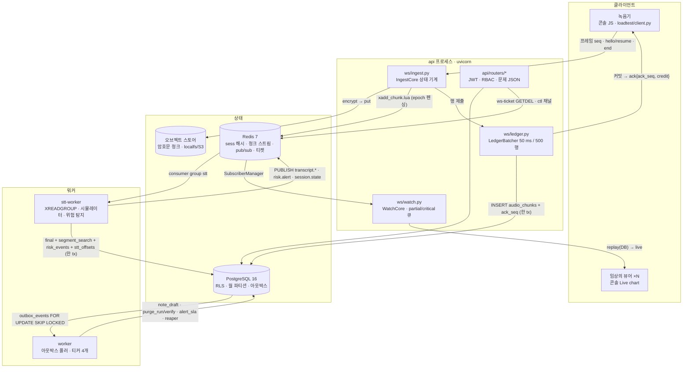

# 아키텍처

> 모든 데이터는 합성(SYNTHETIC)입니다 — 실제 환자 정보 없음. 이 문서는 구성 요소와 데이터 흐름을 설명한다. 프로토콜의 규범은
> [`protocol.md`](protocol.md), 스키마는 [`db/schema.md`](db/schema.md), 숫자는 README 표(모두 JSON 에서 생성)에만 있다.

## 1. 한 장 요약

chartwire 는 SOAPY-class 음성차팅 제품(진료 녹음 → 전사 → SOAP 초안) 아래에 놓이는 **신뢰성·규정 준수 층**이다. STT 모델도,
노트 품질도 다루지 않는다. 다루는 것은 (1) 오디오가 한 청크도 잃거나 겹치지 않고 들어오는 것, (2) 30 의원이 동시에 시작해도 큐가
유한한 것, (3) 위험 발화가 초 단위로 임상의에게 닿는 것, (4) 초안의 모든 문장에 근거가 있는 것, (5) 테넌트가 서로 보이지 않는
것, (6) 철회하면 지워지고 서명하면 남는 것, (7) 수백만 세그먼트에서 빠른 조회, (8) 세션을 떨어뜨리지 않는 배포와 관측이다.

## 2. 프로세스와 경계

| 프로세스 | 진입점 | 하는 일 | 접속 |
|---|---|---|---|
| api | `chartwire serve api` (`api/app.py::create_app`) | REST 37 라우트, WS ingest/watch, 콘솔 서빙, `/metrics` `/healthz` `/readyz`, drain | PG `chartwire_app` · Redis · 오브젝트 스토어 |
| worker | `chartwire serve worker` (`worker/main.py`) | 테넌트별 아웃박스 폴러(리스·재시도·DLQ), 티커: `alert_sla` 1 s · `partition_ensure` 1 h · `outbox_prune` 10 min · `session_reaper` 60 s | PG · Redis |
| stt-worker | `chartwire serve stt-worker` (`stt/worker.py`) | 세션 소유권 리스(`stt:owner`), `XREADGROUP`/`XAUTOCLAIM`, 갭 rebuild(원장 + 오브젝트 스토어), 어댑터(시뮬레이터 / SlowStt / Transcribe 매핑), final 트랜잭션 + 위험 탐지 | PG · Redis · 오브젝트 스토어 |
| all | `chartwire serve all --embedded` (Render) | 위 셋을 한 프로세스의 태스크로, 풀 5, 드레이너 공유 | |

경계 규칙: SQL 은 `db/repo/*` 에만, Redis 키 이름은 `redis/keys.py` 에만, 상태 기계는 sans-I/O(`ws/core.py`)로 두고 셸이 I/O 를 붙인다.
런타임은 **오직** `chartwire_app`(NOBYPASSRLS) 으로 접속한다 — 크로스 테넌트 작업은 테넌트를 순회한다(ADR-0001).

## 3. 데이터 흐름 여섯 단계

1. **티켓 → hello** — REST `POST /sessions/{id}/ws-ticket` 가 30 s 티켓을 Redis 에 두고(`GETDEL` 1회용), WS `hello{ticket}` 이 동의 `recording`
   게이트(4011) 와 DEK 언래핑을 지나 `hello.lua` 로 `epoch` 를 올린다. 옛 연결은 `bye{superseded}` + 4409.
2. **청크 → 원장 → ack** — 프레임(12 B 헤더 + PCM)은 sha256 → AES-GCM 봉투(세션 DEK, AAD 에 tenant/session/seq) → 오브젝트 스토어 →
   `xadd_chunk.lua`(epoch 가 다르면 XADD 하지 않음) → `LedgerBatcher` 가 50 ms 창 또는 500 행마다 테넌트별 한 트랜잭션으로
   `audio_chunks` 삽입 + `sessions.ack_seq` 갱신(같은 tx 에서 `(ack_seq, hint]` 행 수를 세어 일치할 때만). 커밋 뒤에야 `ack`. Redis 는 재구축 가능한 캐시다(ADR-0002).
3. **스트림 → 전사 → 경보** — stt-worker 는 세션 소유권을 잡고 스트림을 읽어 어댑터에 먹인다. final 마다 **한 트랜잭션**: `transcript_segments`
   (파티션 키 `created_at = started_at + t_start_ms`), 동의 `search_index` 면 `segment_search` + `terms[]`, `detector.scan` 히트면 `risk_events`
   (+ SLA ZSET), `stt_offsets` 전진. 커밋 뒤 `transcript.final`/`risk.alert` 를 세션 채널에 발행한다. 갭이 보이면 원장 + 오브젝트 스토어에서 복호화해 재구성한다.
4. **뷰어** — `WatchConnection` 은 SUBSCRIBE → `welcome` → DB 재생(100 행 배치) → 라이브 순서로 붙고, partial 은 256 큐(폐기 + `viewer.lagged`),
   critical 은 1,024 큐(초과 시 4013) 로 격리한다. 느린 뷰어 한 명이 녹음기의 ack 를 늦추지 않는다(시나리오 C).
5. **종료 → 초안** — `end{final_seq}` → 누락 nack → `bye{ended}`; 엔드 마커 → stt-worker `flush` → `state='transcribed'` + 아웃박스 `session.transcribed`
   → 워커 `note_draft` → 추출형 프로바이더 → 검증기 8 규칙 → 정책(verified / needs_review / abstained) → `note.status` 발행 → 콘솔 SOAP 탭 → 검토 → 서명(기록 키 봉인, 10년).
6. **철회 → 파기** — `POST /consents/{id}/revoke` 한 tx: 철회 + 환자 단위 purge job + 아웃박스 → 라이브 세션 `ctl consent_revoked`(4011) →
   워커 `purge_run`(단계 6개: 캡처 → Redis → 오브젝트 → 행 → DEK shred → 환자 shred) → `purge_verify`(unwrap/복호화가 **실패해야** 통과) → 영수증 해시.
   서명 노트는 `legal_hold` 로 살아남는다(ADR-0004).

## 4. 왜 이렇게 나눴나 (ADR 요약)

| ADR | 결정 | 이유 |
|---|---|---|
| [0001](adr/0001-rls-single-app-role-per-tenant-polling.md) | 단일 앱 역할 + RLS, 크로스 테넌트는 순회 | 우회 역할이 없으면 `WHERE tenant_id` 누락이 유출이 아니라 빈 결과가 된다 |
| [0002](adr/0002-ack-means-durable-redis-is-cache.md) | ack = PostgreSQL 커밋, Redis 는 캐시 | Redis 를 잃어도(FLUSHDB) 원장에서 재수화·재구성한다 — 시나리오 D |
| [0003](adr/0003-no-llm-in-safety-path-no-verdict-fields.md) | 안전 경로에 LLM 없음, 스키마에 판정 필드 없음 | 위험 탐지·검증기는 결정론적이라 회귀 테스트가 가능하고, 초안은 구조적으로 진단을 낼 수 없다 |
| [0004](adr/0004-retention-vs-purge-split.md) | 보존(서명 노트, 기록 키) vs 파기(세션 DEK) 분리 | 의료법 보존과 동의 철회가 같은 데이터에 다른 답을 요구한다 |
| [0005](adr/0005-rls-and-non-leakproof-operators.md) | `SECURITY DEFINER search_segments()` | RLS 아래서 비-leakproof 연산자는 인덱스를 잃는다 — 실행계획으로 확인 |

## 5. 재사용: REDI · 마음편의점

같은 층이 DoctorPresso 의 다른 두 제품에 코드 변경 없이 놓인다. **REDI**(≥5 s 음성 일기, 우울 선별)는 진료실 녹음과 같은
문제를 더 짧은 단위로 갖는다: 모바일 네트워크에서 끊기는 업로드에는 같은 seq/ack/credit/resume 인제스트가, 일기 하나마다
독립된 DEK 와 동의 범위(`recording`/`transcription`/`ai_drafting`/`search_index`)에는 같은 봉투 암호화·crypto-shred 파기가, 일기 속
위험 발화에는 같은 stt-worker 트랜잭션 안의 결정론적 탐지 → `risk.alert` → SLA 경로가 그대로 쓰인다(세션 = 일기 한 편, 뷰어 =
담당 상담자). **마음편의점**(텍스트 일기)은 오디오가 없으므로 인제스트를 건너뛰고 텍스트를 `transcript_segments` 로 직접 넣는다;
동의로 게이트되는 `segment_search`/`terms[]` 인덱스와 `risk/detector.scan` 은 입력이 STT 결과든 타이핑이든 구분하지 않는다. 두
경우 모두 테넌시(RLS), 아웃박스 워커, 파기 영수증, 감사 기록은 동일하다 — 바뀌는 것은 스크립트 문법(`synth/grammar.py`)과 콘솔 탭뿐이다.

## 6. 관측과 배포

메트릭 이름은 `ops/metrics.py` 한 곳에 있다(`ws_*`, `ledger_*`, `stt_*`, `risk_*`, `outbox_*`, `handler_*`, `note_*`, `purge_*`, `db_pool_in_use`).
`/healthz` 는 드레인 중에도 200(컨테이너가 드레인 중인 프로세스를 죽이지 않게), `/readyz` 는 PG/Redis 프로브 + 드레인 503.
SIGTERM 은 api 에서 `bye{drain}` → 원장 플러시 → 1012, 워커에서 클레임 중단 → 진행 중 핸들러 완료, stt-worker 에서 소비자 정지 + 리스 해제.
컨테이너/compose/Render 는 [`../docker-compose.yml`](../docker-compose.yml)·[`../render.yaml`](../render.yaml), AWS 는 [`aws.md`](aws.md)(synth 만, 미배포).
