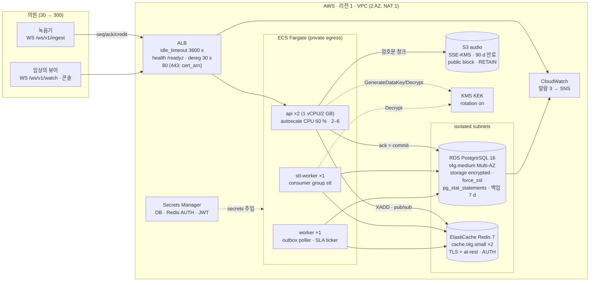

# AWS 배포 설계 (CDK) — synth 만 수행, 배포하지 않음

> 모든 데이터는 합성(SYNTHETIC)입니다 — 실제 환자 정보 없음.
>
> **이 스택은 AWS 계정 없이 `cdk synth` 로 합성(synthesize)만 했고 실제로 배포한 적이 없다.** 합성 결과
> `infra/cdk/cdk.out/ChartwireStack.template.json` 은 저장소에 커밋되어 CI(`cdk` 잡)가 `git diff --exit-code` 로 드리프트를
> 막고, `infra/cdk/tests/test_stack.py` 가 `Template.from_stack` 으로 보안 속성을 단언한다. 이 문서의 비용·용량 수치는
> **가격표 가정에 기반한 추정**이며 실측이 아니다(README 의 실측 표와 섞지 않는다, 스펙 §0.2/§11.4).

관련 파일: `infra/cdk/stack.py`(단일 `ChartwireStack`), `infra/cdk/app.py`(cdk-nag `AwsSolutionsChecks` — ERROR 0),
`infra/cdk/nag-suppressions.md`(억제 사유), `infra/cdk/tests/test_stack.py`.

## 1. 아키텍처

**설계 원칙과 스택의 대응**

| 원칙(스펙) | 스택에서의 구현 |
|---|---|
| ack = PostgreSQL durable (§0.3) | api → RDS Multi-AZ 동기 복제; Redis 는 재구축 가능한 캐시라 ElastiCache 스냅샷을 켜지 않음 |
| 런타임은 `chartwire_app` 만 (§0.7) | 마이그레이션은 배포 파이프라인의 일회성 태스크(`chartwire db upgrade`, owner 자격 증명)로 분리, 서비스 태스크에는 app 자격 증명만 주입 |
| PHI 봉투 암호화 (§8.2) | KEK = KMS 키 1개(회전 on); 태스크 역할은 `kms:GenerateDataKey`/`kms:Decrypt` 두 권한만(`test_task_role_is_least_privilege`) |
| 파기 = crypto-shred + hard delete (§8.4) | S3 버킷 접두사 `{tenant}/{session}/` 삭제 권한(`s3:*Object`), 버저닝 off(버전이 남으면 파기가 거짓말이 된다), 90 d 라이프사이클은 안전망 |
| 긴 WebSocket 세션 (§6) | ALB `idle_timeout=3600` — 기본 60 s 면 조용한 진료 중 연결이 끊긴다; heartbeat 15 s 와 함께 동작 |
| 무중단 배포 (§6.4 drain) | 대상 그룹 deregistration 30 s ≥ 드레인 예산 20 s; `/readyz` 가 503 이면 새 연결이 오지 않음 |
| 운영 가시성 (§7, §12) | ALB 5XX > 10/5 min, RDS CPU > 80 %, UnHealthyHostCount ≥ 1 → SNS; Container Insights |

cdk-nag 로 **수정**한 항목(기본 포트 회피, ALB 접근 로그, VPC Flow Log, Multi-AZ, 삭제 보호, TLS 강제)과 **억제**한
항목(공개 ALB 80/443, 버킷 접근 로그, 비밀 회전, 환경 변수, S3 오브젝트 와일드카드)의 사유는 `infra/cdk/nag-suppressions.md`.

## 2. 30 의원 → 300 의원 용량 산정

산정의 입력은 §11.2 부하 시나리오의 **실측 결과**(`docs/loadtest/results.md`, `docs/loadtest/*.json`)다. 이 문서는 수치를
옮겨 적지 않고 **어떤 레버를 어떤 규칙으로 움직이는지**만 적는다.

가정: 의원당 동시 진료실 1개(녹음기 1 + 뷰어 1–2), 200 ms 청크(세션당 5 chunk/s, 6.4 KB), 진료 40 분, 09:00 동시 시작.

| 자원 | 30 의원 (스택 기본값) | 300 의원 | 규칙 |
|---|---|---|---|
| api 태스크 | 2 (CPU 60 % 오토스케일, 최대 6) | 최대치 상향(6 → 12) + 태스크 크기 유지 | 태스크당 처리량은 시나리오 A(N=50/100/200)의 chunk/s·CPU 로 결정; 스케일 아웃만 하면 된다(세션 상태는 Redis·PG 에 있고 프로세스는 무상태) |
| stt-worker | 1 | N/`stt:owner` 리스당 세션 수에 맞춰 2–4 | 세션 소유권 리스(`stt:owner:{sid}`)로 워커를 늘리면 자동 분담; 지연이 credit 을 깎아 녹음기를 감속시킨다(시나리오 B) |
| worker(outbox) | 1 | 2 | 시나리오 H 의 events/s 대비 하루 이벤트 수(세션당 ≈ 4개: transcribed/draft/…)로 충분; 리스로 안전하게 병렬화 |
| RDS | t4g.medium Multi-AZ | r6g.large Multi-AZ (+ 읽기 복제본은 검색 트래픽이 생길 때) | 쓰기는 청크 원장(세션당 5 row/s → 300 세션 1,500 row/s; `LedgerBatcher` 가 50 ms/500 행 단위로 테넌트별 한 트랜잭션에 묶는다)과 세그먼트; 읽기는 §4.6 의 keyset 쿼리. 병목은 CPU 보다 `audio_chunks`/`transcript_segments` 의 파티션·인덱스 크기 |
| 스토리지 | gp3, 세그먼트 파티션 월 단위 | 파티션 유지 + `audio_chunks` 만료(오디오는 세션 종료 후 파기/만료) | 세션당 세그먼트 수 × 암호문 크기로 선형; `segments_default_partition_rows` 알람이 파티션 누락을 잡는다 |
| Redis | cache.t4g.small ×2 | cache.m6g.large ×2 | 세션당 스트림 `MAXLEN ~2000` × 엔트리 ≈ 수백 KB 상한, pub/sub 팬아웃은 뷰어 수에 비례; 메모리보다 pub/sub 대역이 먼저 문제 |
| S3 | 세션당 40 분 × 5 chunk/s × 6.4 KB ≈ 77 MB | 하루 300 세션 ≈ 23 GB/day, 90 d 만료 | 파기 파이프라인이 접두사 삭제; 라이프사이클은 안전망 |
| ALB | 1 | 1 (LCU 자동) | 연결 수(300 × 3)는 ALB 한계와 멀다; `idle_timeout` 만 중요 |

09:00 동시 시작 스파이크는 stt-worker 의 지연 → `stt:lag` → credit 감소 → `pause{stt_lag}` 로 **녹음기 쪽에서 흡수**된다
(시나리오 B 가 확인하는 성질). 따라서 300 의원에서도 api 메모리는 세션 수에 선형이며 큐 길이는 `stream_maxlen` 으로 유계다.

## 3. 비용 스케치 (가정 기반 추정, 실측 아님)

가정: ap-northeast-2 온디맨드 가격표(2026-09 기준 근사값, 세금·데이터 전송·프리티어 제외), 월 730 h, 데이터 전송은
의원 트래픽이 작아(세션당 ≈ 77 MB 인입, 인입은 무료) 무시. **수치는 자리수 감각을 위한 것이며 견적이 아니다.**

| 항목 | 30 의원 (스택 기본값) | 300 의원 | 비고 |
|---|---|---|---|
| Fargate (1 vCPU/2 GB ≈ $36/월·태스크) | 4 태스크 ≈ $145 | ~14 태스크 ≈ $500 | api 6–12, stt 2–4, worker 2 |
| RDS PostgreSQL Multi-AZ | t4g.medium ≈ $95 + 100 GB gp3 ≈ $25 | r6g.large ≈ $350 + 1 TB ≈ $250 | 백업 7 d 포함 스토리지 별도 |
| ElastiCache Redis (2 노드) | t4g.small ≈ $47 | m6g.large ≈ $230 | 스냅샷 없음 |
| NAT Gateway 1 | ≈ $35 + 처리량 | ≈ $35 + 처리량 | 이미지 pull·KMS·S3 는 VPC 엔드포인트로 줄일 수 있음 |
| ALB | ≈ $20 + LCU | ≈ $30 + LCU | 장시간 연결은 LCU 의 "연결" 차원만 소비 |
| S3 + KMS + Secrets + CloudWatch | ≈ $15 | ≈ $80 | S3 ≈ 2 TB/90 d 에서 $50 수준 |
| **합계(근사)** | **≈ $380/월** | **≈ $1,500/월** | 의원당 ≈ $13 → ≈ $5 |

읽는 법: 10배 규모에서 비용은 ≈ 4배다. 상태를 갖는 자원(RDS·Redis)은 계단식으로, 무상태 자원(Fargate)은 선형으로
늘어난다. 절감 레버는 순서대로 (1) Fargate Savings Plan / Graviton(이미 arm64 가정), (2) RDS Reserved, (3) NAT 대신
VPC 엔드포인트, (4) 오디오 만료를 90 d 에서 세션 종료 + 파기 확인 직후로 앞당기기(오디오는 진료기록이 아니다, ADR-0004).

## 4. 배포하지 않은 것과 하려면 필요한 것

- **계정·도메인·인증서**: `cert_arn` 파라미터가 비어 있으면 443 리스너가 생성되지 않는다(80 만). 실제 서비스는 443 필수.
- **이미지**: `ImageRepo`/`ImageTag` 파라미터(ECR). CI 의 `docker` 잡은 이미지를 빌드만 하고 push 하지 않는다.
- **마이그레이션 태스크**: `chartwire db upgrade` 를 owner 자격 증명으로 실행하는 일회성 ECS RunTask 는 스택 밖(배포
  파이프라인)이다 — 런타임 태스크 정의에 owner 비밀을 넣지 않기 위해서다(§0.7).
- **KMS 실사용**: `AwsKmsKek` 는 인터페이스와 매핑 코드만 있고 오프라인에서 실행되지 않았다(§8.2 범위 밖).
- **실측**: 이 문서의 어떤 수치도 AWS 에서 측정된 것이 아니다. README 의 부하 수치는 "same host, 4 vCPU, loopback, STT
  simulator, client-confounded" 조건의 로컬 실측이다.
