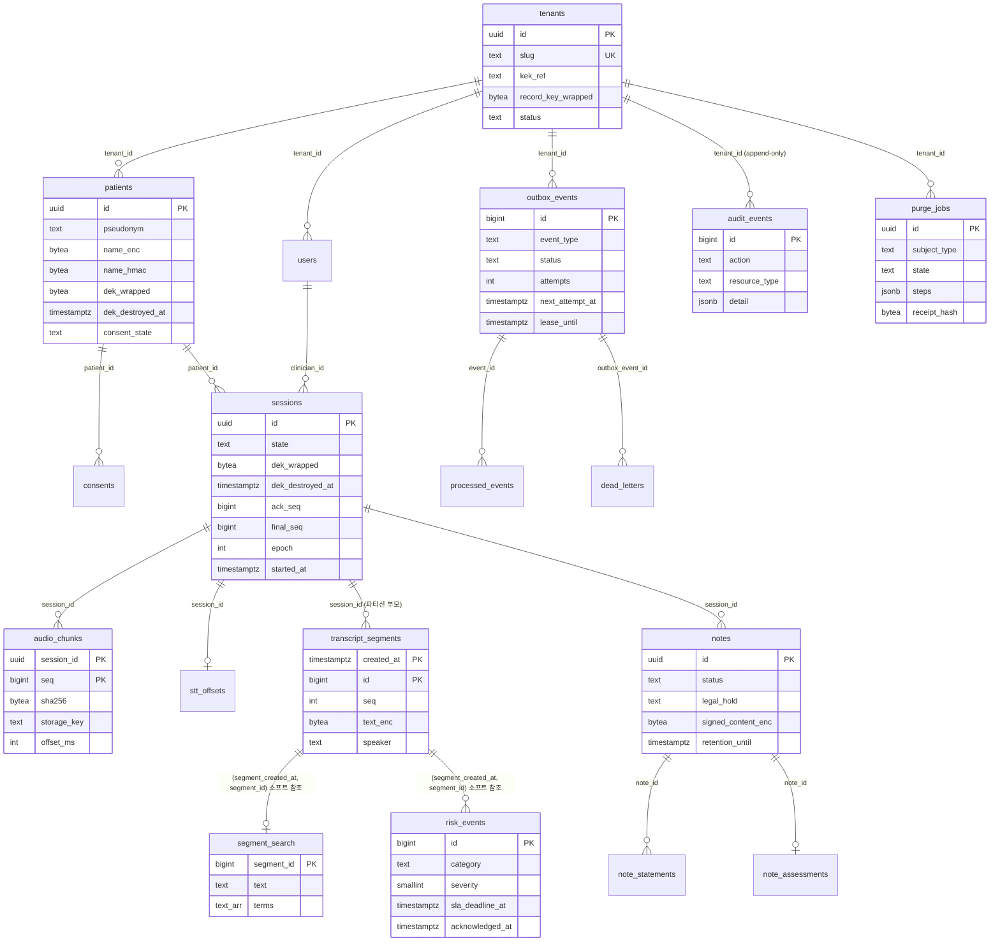

# 데이터베이스 스키마 — PostgreSQL 16

> 모든 데이터는 합성(SYNTHETIC)입니다 — 실제 환자 정보 없음. 이 문서는 마이그레이션이 실제로 실행하는 DDL(spec §4.2)을 설명한다.
> 기계가 만든 정본은 `docs/db/schema.sql`(`chartwire db schema-dump`, `pg_dump --schema-only --no-owner` 에서 변동 라인 제거)이며
> CI `migrations` 잡이 라이브 스키마와 비교한다. 성능 연구(§4.6)의 실측 결과는 `docs/perf/README.md`(WP-F)에 있다.

## 1. 역할과 접속 경로

| 역할 | 용도 | 속성 |
|---|---|---|
| `chartwire_owner` | 모든 객체 소유, Alembic 실행, SECURITY DEFINER 함수 소유, 테스트 픽스처(TRUNCATE) | LOGIN, NOBYPASSRLS — 그래도 `FORCE RLS` 대상 |
| `chartwire_app` | **런타임 프로세스 전부**(api, worker, stt-worker) | LOGIN, NOBYPASSRLS, NOINHERIT, owner 멤버 아님, `statement_timeout=5s` |
| superuser | `chartwire db bootstrap-roles`, 성능 연구(RLS 비교), `test_superuser_leaks.py` | 런타임에서 절대 사용 안 함 |

GUC 세 개(`app.tenant_id`, `app.user_id`, `app.role`)는 `db.tenant.tenant_tx()` 가 `BEGIN` 안에서 `set_config(…, true)` 로만 설정한다.
트랜잭션이 끝나면 사라지므로 커넥션 풀을 통해 새지 않는다(`tests/rls/test_guc_leak.py`).

## 2. ERD

## 3. 테이블 목록 (리비전별)

| 리비전 | 테이블 | 역할 | `chartwire_app` 권한 | 암호화 컬럼 / 비고 |
|---|---|---|---|---|
| 0001 | `tenants` | 의원. `kek_ref`, **record key**(서명 노트용, 절대 파기 안 함) | SELECT | RLS 없음 |
| 0001 | `users` | 임상의/스태프/관리자/감사자/녹음기 | SIUD | `email_enc`(record key), `email_hmac` 블라인드 인덱스 |
| 0001 | `patients` | `가상환자-NNNN`. 환자 DEK, `is_synthetic=true` | SIUD | `name_enc`, `phone_enc`(환자 DEK), `name_hmac` |
| 0001 | `consents` | 버전이 있는 동의 행; `revoked_at IS NULL` 부분 인덱스 | SIUD | `scopes <@ {recording,transcription,ai_drafting,search_index}` |
| 0002 | `sessions` | 상담 세션 상태 기계, 세션 DEK, `ack_seq`/`final_seq`/`epoch` | SIUD | DEK 부활 방지 트리거 `sessions_dek_guard` |
| 0002 | `audio_chunks` | 청크 **메타데이터 원장**(바이트는 객체 저장소). `PK(session_id, seq)` 가 중복 방지 | SIUD | ack 의 근거(ADR-0002) |
| 0002 | `stt_offsets` | stt-worker 재개 오프셋 | SIUD | |
| 0003 | `transcript_segments` | **월별 RANGE 파티션** 부모, `PK(created_at, id)`, `UNIQUE(session_id, seq, created_at)` | S, I, D (UPDATE 없음) | `text_enc`(세션 DEK) |
| 0003 | `transcript_segments_default` + `_yYYYYmMM` | 파티션. 각각 RLS/정책/GRANT 를 따로 가진다 | S, I, D | |
| 0003 | `segment_search` | 동의 범위 `search_index` 일 때만 채우는 **평문** 검색 파생물; 파기 시 DELETE | SIUD | ENABLE RLS only (owner 면제) |
| 0004 | `risk_events` | 결정론적 위험 탐지 결과 + SLA/승인/에스컬레이션 | SIUD | `phrase` 는 평문 문구(사전 항목), 발화 전체 아님 |
| 0004 | `notes`, `note_statements`, `note_assessments` | SOAP 초안/서명 노트, 문장별 근거·판정, 임상의 Assessment | SIUD | `raw_draft_enc`, `text_enc`(세션 DEK), `signed_content_enc`(record key) |
| 0005 | `outbox_events`, `processed_events`, `dead_letters` | 트랜잭션 outbox, 멱등 원장, DLQ | SIUD | |
| 0005 | `audit_events` | **append-only** 감사 로그(트리거 + INSERT/SELECT 권한만) | **S, I** | `detail` 은 id/개수/해시만 |
| 0005 | `purge_jobs` | 파기 작업 + 단계/개수/DEK 지문/영수증 해시 | SIUD | `sample_ciphertext` 는 복호 실패 시연용 |

시퀀스: `transcript_segments_id_seq`(USAGE, SELECT — 파티션 부모는 identity 불가), `audit_events_id_seq`(USAGE, SELECT — 아래 §5 참조).
함수: `ensure_segment_partition(date)`, `search_segments(text, text, uuid, int)` 에 EXECUTE.

## 4. RLS 정책

정책 식은 어디서나 동일하다: `tenant_id = NULLIF(current_setting('app.tenant_id', true), '')::uuid`.
`current_setting(…, true)` 는 GUC 가 없으면 NULL 이 아니라 **빈 문자열**을 돌려주므로 `NULLIF` 가 없으면 `''::uuid` 캐스트 오류가 난다;
있으면 NULL 비교 → 0행(fail-closed).

| 테이블 | ENABLE | FORCE | 정책 | 종류 | 효과 |
|---|---|---|---|---|---|
| 모든 테넌트 테이블 + 모든 파티션 | ✓ | ✓ | `tenant_isolation` USING/WITH CHECK 테넌트 일치 | PERMISSIVE, ALL | owner 조차 정책 대상; 컨텍스트 없으면 0행, 외부 `tenant_id` INSERT 거부 |
| `segment_search` | ✓ | ✗ | `tenant_isolation` | PERMISSIVE, ALL | owner(=`search_segments()` 실행 컨텍스트)는 면제 → 트라이그램 GIN 사용 가능 |
| `notes`, `note_statements`, `note_assessments` | ✓ | ✓ | `role_gate` USING `app.role IN ('clinician','service','auditor')` | **RESTRICTIVE**, ALL | 스태프/관리자는 라우터가 실수해도 노트 내용 0행 |
| `audit_events` | ✓ | ✓ | `tenant_isolation` + `audit_read_gate` USING `app.role IN ('auditor','admin','service')` | RESTRICTIVE, **SELECT** | 누구나(테넌트 안에서) 기록, 감사자/관리자/서비스만 조회 |
| `tenants` | ✗ | ✗ | — | — | app 은 SELECT 만 |

검증 테스트: `tests/rls/test_rls_leak.py`(원시 SQL, GUC 없음, 외부 tenant INSERT, `SET ROLE owner` 거부), `test_partition_direct.py`(파티션 이름으로 직접 조회),
`test_superuser_leaks.py`(같은 쿼리가 superuser 에게는 두 테넌트를 보여줌 — 픽스처가 진짜임을 증명), `test_audit_immutable.py`, `test_guc_leak.py`.

## 5. 파티션 (`transcript_segments`)

- `PARTITION BY RANGE (created_at)`, `created_at = sessions.started_at + t_start_ms`(결정론적). 월별 파티션 `transcript_segments_yYYYYmMM` + DEFAULT 파티션.
- 0003 이 현재 달 −1..+2 를 만들고, 워커 티커 `partition_ensure`(매시간)가 `ensure_segment_partition(m)` 으로 +1, +2 를 보장하며 DEFAULT 파티션이 비어 있는지 메트릭으로 감시한다.
- `ensure_segment_partition()` 은 SECURITY DEFINER: 파티션 생성 + `ENABLE/FORCE RLS` + `tenant_isolation` + `GRANT S,I,D TO chartwire_app` 을 한 트랜잭션에서 수행하고,
  0007 이후에는 파티션 인덱스 `ix_segments_patient_time_yYYYYmMM` 을 만들어 부모 인덱스에 ATTACH 한다(PG 가 자동 생성한 인덱스는 이름만 정규화).
- 부모 조회 시 프루닝 조건: 환자 타임라인은 `created_at >= now() - 6 months`, 세션 replay 는 `created_at >= sessions.started_at`
  (`repo/segments.replay` 가 값을 모르면 직접 조회해 넣는다). 조건이 없으면 모든 파티션에 인덱스 프로브가 간다(§4.6 Q1a).

## 6. 마이그레이션 순서

| 리비전 | 내용 | downgrade |
|---|---|---|
| 0001_core | 확장 확인, `tenants`, `users`, `patients`, `consents`, GRANT | 테이블 DROP |
| 0002_sessions | `sessions`, `audio_chunks`, `stt_offsets`, `trg_dek_no_resurrect` 트리거 | 트리거/함수/테이블 DROP |
| 0003_segments | 시퀀스, 파티션 부모/DEFAULT, `ensure_segment_partition` v1, 초기 파티션 4개, `segment_search` | 부모 DROP(파티션·시퀀스 연쇄) |
| 0004_risk_notes | `risk_events`, `notes`, `note_statements`, `note_assessments` | DROP |
| 0005_ops | `outbox_events`, `processed_events`, `dead_letters`, `audit_events` + append-only 트리거, `purge_jobs` | DROP |
| 0006_rls | 모든 테넌트 테이블·파티션에 RLS, `role_gate`, `audit_read_gate` — 성능 연구 **before** | 정책 DROP, RLS 해제 |
| 0007_perf | GIN(trgm/terms), 부분 인덱스(SLA/outbox), **무중단 파티션 인덱스**, `search_segments()`, `ensure_segment_partition` v2 — **after** | 인덱스/함수 DROP, v1 복원 |

규칙(§4.3): sync `psycopg` + `chartwire_owner`, `transaction_per_migration=True`, `CREATE INDEX CONCURRENTLY` 는 `autocommit_block()` 안에서만,
모든 리비전이 `downgrade()` 구현, `alembic check` 미사용(autogenerate 는 파티션/RLS/트리거를 모른다). 역할은 마이그레이션이 아니라 `bootstrap-roles` 가 만든다
(`helpers.grant()` 는 역할이 없으면 GRANT 를 건너뛴다 — 단일 역할 폴백).

## 7. 함정 (실제로 부딪힌 것들)

1. **파티션 부모에는 identity 컬럼을 쓸 수 없다** (PG16). `transcript_segments.id` 는 `bigint DEFAULT nextval('transcript_segments_id_seq')` 이며 시퀀스를 컬럼에 `OWNED BY` 로 묶어 DROP 이 연쇄되게 했다. app 역할에는 시퀀스 `USAGE, SELECT` 가 필요하다.
2. **파티션 테이블의 UNIQUE/PK 는 파티션 키를 포함해야 한다.** 그래서 PK 가 `(created_at, id)`, 멱등 키가 `(session_id, seq, created_at)` 이다.
   결과적으로 `risk_events`/`note_statements`/`segment_search` 는 FK 대신 `(segment_created_at, segment_id)` **소프트 참조**를 쓴다.
3. **`CREATE INDEX CONCURRENTLY` 는 파티션 부모에 쓸 수 없다.** 무중단 경로: 부모에 `ON ONLY`(invalid 껍데기) → 파티션마다 `CONCURRENTLY`(autocommit 블록) → `ATTACH PARTITION`; 마지막 ATTACH 에서 부모가 valid 가 된다. 이후 새 파티션은 `ensure_segment_partition` v2 가 인덱스를 붙인다.
4. **2음절 한국어 패턴은 트라이그램이 0개** (`'불면'` → `pg_trgm` 인덱스 무용, Seq Scan). API 는 자유 텍스트 검색에 ≥3자를 요구하고, 2음절 키워드는 `terms[]` GIN(`@>`)으로 정확 일치한다.
5. **RLS 안에서는 `ILIKE`/`similarity` 가 leakproof 가 아니라 인덱스가 무시된다** (`pg_proc.proleakproof`, `docs/perf/leakproof.txt`). 정책이 걸린 테이블에 GIN 을 만들어도 `chartwire_app` 은 Bitmap+Filter 로 떨어진다. 해결: `search_segments()` SECURITY DEFINER 가 owner 로 실행되고 `segment_search` 는 FORCE 가 아닌 ENABLE 만 건다.
6. **`NULLIF(current_setting(…, true), '')`**: `missing_ok=true` 는 빈 문자열을 돌려준다. `NULLIF` 없이는 컨텍스트 없는 접속이 "0행" 대신 캐스트 오류를 낸다 — 에러도 안전하긴 하지만 관측이 지저분해지고 리포트 쿼리가 깨진다.
7. **`INSERT … RETURNING` 은 SELECT 정책을 탄다.** `audit_events` 의 읽기 게이트 때문에 임상의 컨텍스트에서 RETURNING 은 "new row violates row-level security policy" 로 실패한다. `repo/audit.record` 는 `inline()` INSERT 뒤 `currval(pg_get_serial_sequence(…))` 로 id 를 얻는다(그래서 `audit_events_id_seq` 에 GRANT).
   같은 이유로 `WHERE` 가 있는 UPDATE/DELETE 도 SELECT 정책을 타므로, 감사 로그의 "owner 가 UPDATE 해도 트리거가 막는다" 테스트는 `service` 컨텍스트로 실행한다.
8. **관리형 PG 단일 역할 폴백** (`CHARTWIRE_DB_SINGLE_ROLE=1`, Render 등): `chartwire_app` 이 없으면 `helpers.grant()` 가 GRANT 를 건너뛰고 앱은 owner 로 접속한다. `FORCE ROW LEVEL SECURITY` 덕분에 격리는 그대로지만 `segment_search` 의 owner 면제가 사라져 검색이 RLS(느린) 경로로 떨어진다. `docs/limitations.md` 에 명시.
9. **월별 파티션은 달력에 따라 이름이 바뀐다.** `schema-dump` 는 `_yYYYYmMM` 블록과 `pg_dump` 버전 주석, `\restrict` 토큰을 제거해 덤프를 결정론적으로 만든다(`db.cli.normalize_schema_dump`, 단위 테스트 있음).
