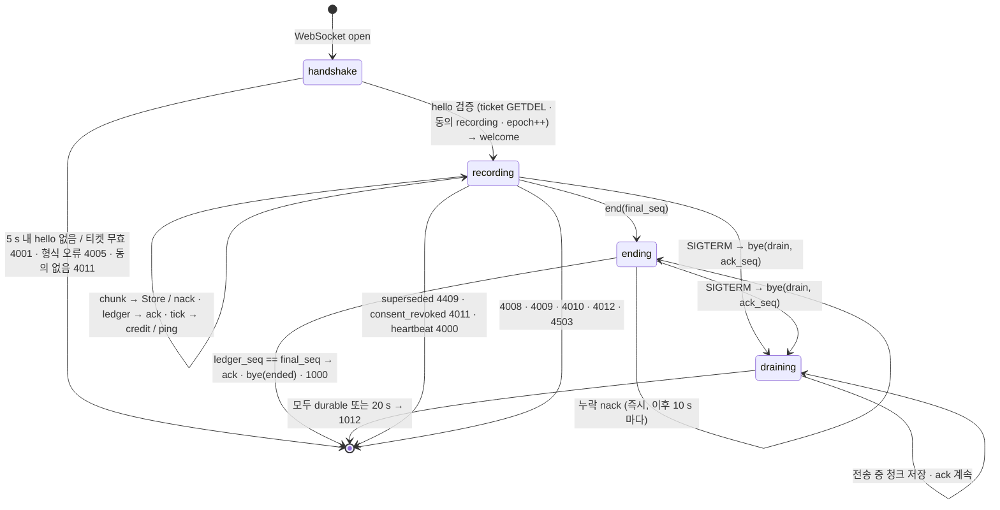
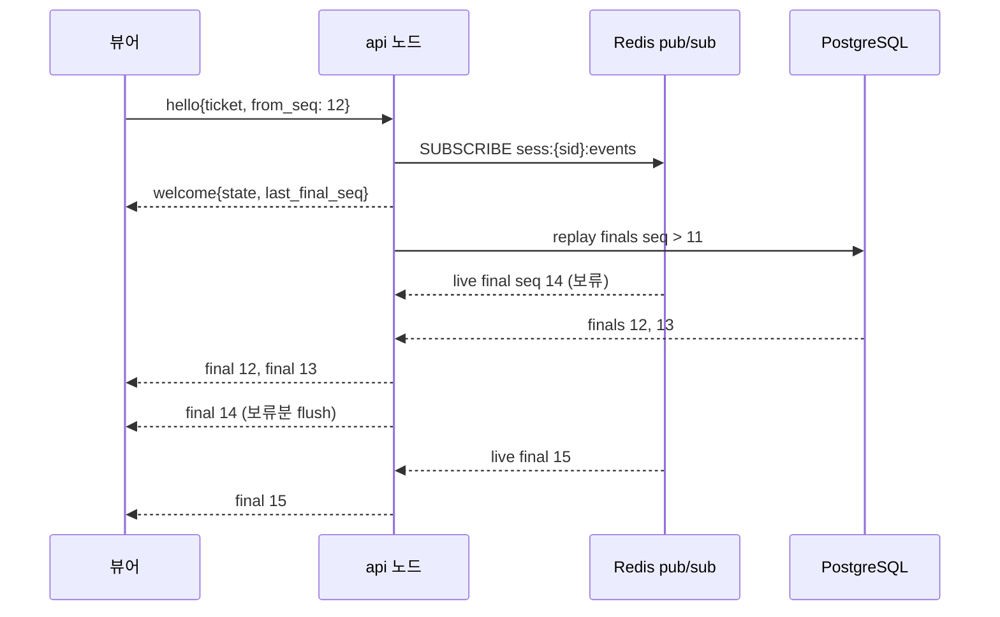

# chartwire WebSocket 프로토콜 (규범 문서)

이 문서는 스펙 §6.1–§6.8 의 규범 사본이다. 코드(`src/chartwire/ws/`)와 이 문서가 다르면 둘 중 하나가 버그다.
구현 대응: 프레임 코덱 `codec.py`, JSON 메시지 `messages.py`, 상태 기계 `core.py`(sans-I/O, mypy strict),
플로우 컨트롤 `credit.py`, 액션·종료 코드 `actions.py`. 상태 기계는 `tests/ws/test_*_props.py` 의 hypothesis
stateful 테스트로 검증한다(무손실·무중복·ack 단조 불변식).

> 모든 데이터는 합성(SYNTHETIC)입니다 — 실제 환자 정보 없음. 이 문서의 예시 세션·환자는 전부 가상이다.

## 0. 한눈에 보기

| 항목 | 값 |
|---|---|
| 엔드포인트 | `GET /ws/v1/ingest`(녹음기), `GET /ws/v1/watch`(뷰어) |
| 인증 | 첫 텍스트 프레임 `hello.ticket` — `POST /v1/sessions/{id}/ws-ticket` 가 발급한 30 s 일회용 티켓 |
| 오디오 | 바이너리 프레임, 12 B 리틀엔디언 헤더 + PCM16LE mono 16 kHz, 200 ms(6,400 B), 최대 65,536 B |
| 신뢰성 | 1부터 시작하는 `seq`, 누적 `ack`(= PostgreSQL 커밋 완료), `nack{missing}`, 재접속 `resume` |
| 흐름 제어 | `credit`(미확인 청크 허용량, 0–100), 허용 초과 +20 까지, 그 이상 4009 |
| 생존성 | 서버 `ping` 15 s, `pong` 2회 연속 누락 시 4000 |
| 단일 활성 연결 | `hello` 마다 `epoch` 증가, 이전 연결은 `bye{superseded}` + 4409 |
| 종료 | `end{final_seq}` → 원장 확인 → `bye{ended}` + 1000 · 배포 시 `bye{drain}` → ≤20 s 플러시 → 1012 |

핵심 규칙 하나: **`ack_seq` 는 `audio_chunks` 1..n 행이 PostgreSQL 에 커밋된 뒤에만 올라간다.** Redis 는 재구축
가능한 캐시일 뿐이다(ADR-0002). 그래서 ack 왕복 시간에는 원장 배치(50 ms)만큼의 바닥이 있다.

## 1. 엔드포인트와 티켓 인증

1. 클라이언트는 REST 로 `POST /v1/sessions/{id}/ws-ticket` `{"kind": "ingest" | "watch"}` 를 호출한다
   (`Authorization: Bearer <JWT>`; clinician 은 자기 세션의 ingest/watch, staff 는 watch, recorder 는 ingest).
   응답 `{"ticket": "...", "expires_in": 30}`. 티켓은 Redis `ticket:{ticket}` 에 `{tenant_id, user_id, role, session_id, kind}`
   로 30 s 저장되고 `GETDEL` 로 소비된다(정확히 한 번). 발급은 principal 당 30/min.
2. WebSocket 을 연다. URL 에는 어떤 자격 증명도 넣지 않는다.
3. **5 s 안에** 첫 텍스트 프레임으로 `hello` 를 보낸다. 티켓이 없거나 만료·재사용이거나 `session_id`/`kind`/사용자가
   맞지 않으면 `4001`. 5 s 안에 `hello` 가 오지 않아도 `4001`. `hello` 의 필드 검증 실패(알 수 없는 필드 포함)는 `4005`.
   `hello` 는 세션당 10/min 으로 제한된다(초과 시 `4013`).
4. 녹음 세션의 `hello` 는 환자의 동의 범위 `recording` 을 다시 확인한다(스냅샷이 아니라 현재 동의). 없으면 `4011`.
5. 서버는 `welcome` 을 보낸다. 그 뒤부터 §3 의 메시지가 오간다.

### 1.1 epoch 펜싱 — 세션당 활성 녹음 연결은 하나

`hello` 마다 `sess:{sid}.epoch` 가 1 증가한다(Lua `hello.lua`, 원자적). 새 연결이 epoch *n+1* 로 올라오면 이전 연결은
`ctl:{sid}` 채널로 `{"t":"superseded","epoch":n+1}` 를 받고, 마지막 durable 위치를 `ack` 로 밀어낸 뒤
`bye{reason:"superseded", ack_seq}` 를 보내고 `4409` 로 닫는다. 이전 epoch 로 태그된 청크는 스트림에 들어가지 않는다
(`xadd_chunk.lua` 가 `ep` 를 비교, 메트릭 `ws_chunks_total{result="stale"}`). 잠금이나 TTL 대기가 없으므로 네트워크가
갑자기 끊긴 뒤의 재접속은 항상 즉시 성공한다. 뷰어 연결 수는 제한이 없다.

## 2. 바이너리 오디오 프레임 (녹음기 → 서버)

12 바이트 리틀엔디언 헤더 뒤에 페이로드가 붙는다. 텍스트 프레임은 JSON, 바이너리 프레임은 오디오 — 섞이지 않는다.

```
offset  size  field      value
0       u16   magic      0x4357  ('C','W')
2       u8    ver        1
3       u8    flags      bit0 LAST_CHUNK · bit1 SILENCE · bit2 SIM (그 외 비트는 오류)
4       u32   seq        1부터, 청크마다 +1
8       u32   offset_ms  세션 시작 기준 오디오 오프셋(ms)
12      …     payload    PCM16LE mono 16 kHz — chunk_ms 200 → 6,400 B, 1 ≤ len ≤ 65,536
```

| 검증 | 실패 시 |
|---|---|
| 길이 < 12, magic ≠ 0x4357, ver ≠ 1, 알 수 없는 flag 비트, `seq == 0`, 빈 페이로드 | `4010 bad_frame` |
| 페이로드 > 65,536 B | `4010 payload_too_large` |
| `SIM` 플래그인데 서버 설정 `allow_sim_frames=false` | `4005 sim_not_allowed` |

`SIM` 프레임의 페이로드는 시드 기반 의사난수 바이트다(청크마다 sha256 이 달라진다). STT 시뮬레이터는 페이로드가 아니라
`(script_ref, offset_ms)` 로 구동된다. `LAST_CHUNK` 는 정보성 플래그이며 종료는 항상 `end` 메시지로 선언한다.

## 3. JSON 메시지

모든 텍스트 프레임은 UTF-8 JSON 객체 하나이고 `"t"` 필드로 종류를 구분한다. 모델은 `extra='forbid'` — **알 수 없는
필드는 오류**다(조용히 무시하지 않음). `null` 인 선택 필드는 생략된다. UUID 는 문자열, 시각(`committed_at`,
`sla_deadline_at`)은 ISO-8601 UTC 문자열, `ts` 는 서버 밀리초 정수다. 표기 `?` 는 선택 필드.

### 3.1 녹음기 → 서버

| t | 필드 | 의미 |
|---|---|---|
| `hello` | `ticket`, `proto:1`, `codec:"pcm16le"`, `sample_rate:16000`(8000–48000), `chunk_ms:200`(20–1000), `resume:bool`, `last_sent_seq?`(resume 시 필수) | 첫 프레임. `resume:true` 면 §4.4 |
| `end` | `final_seq ≥ 0` | 마지막 청크 seq 선언. `0` 이면 청크 없이 종료 |
| `pause` | — | 세션 상태를 `paused` 로 표시(`session.state` 이벤트). seq/ack/credit 규칙에는 영향 없음 |
| `resume_rec` | — | 세션 상태를 `recording` 으로 복귀 |
| `pong` | `ts` | 서버 `ping.ts` 를 그대로 되돌림 |

### 3.2 서버 → 녹음기

| t | 필드 | 언제 |
|---|---|---|
| `welcome` | `session_id`, `epoch`, `ack_seq`, `credit`, `heartbeat_ms:15000`, `missing:[[from,to],…]` | `hello` 수락 직후. `ack_seq` 는 durable 연속 접두사, `missing` 은 §4.4 |
| `ack` | `ack_seq`, `credit` | 누적 확인. §4.2 의 배치 규칙 |
| `nack` | `missing:[[from,to],…]` | 누락 구간 재전송 요청. 구간은 닫힌 구간, 오름차순 |
| `credit` | `credit` | 크레딧이 마지막 광고값 대비 25 % 넘게 변했을 때 즉시 |
| `pause` | `reason:"stt_lag"｜"storage"`, `retry_ms` | `credit == 0` 이 2 s 넘게 지속 |
| `transcript.final` | §3.4 와 동일 | 선택적 미러(녹음기 UI 용) |
| `risk.alert` | §3.4 와 동일 | 선택적 미러 |
| `session.state` | `state` | 세션 상태 변화 |
| `error` | `code`, `message`, `retryable` | 종료 직전 이유 설명. `code` 는 §7 의 종료 코드와 같은 값 |
| `ping` | `ts` | 15 s 마다 |
| `bye` | `reason:"drain"｜"superseded"｜"ended"｜"consent_revoked"`, `ack_seq?` | 서버가 닫기 전에. §4.6–4.8 |

### 3.3 뷰어 → 서버

| t | 필드 | 의미 |
|---|---|---|
| `hello` | `ticket`, `from_seq?` | `from_seq` 이상의 final 부터 재생. 생략 시 처음부터 |
| `risk.ack` | `risk_event_id` | 경보 확인(서버가 `risk.ack{…, by}` 로 모든 뷰어에 방송) |
| `pong` | `ts` | |

### 3.4 서버 → 뷰어

| t | 필드 |
|---|---|
| `welcome` | `session_id`, `state`, `last_final_seq`(-1 = 아직 없음) |
| `transcript.partial` | `from_seq`, `text` |
| `transcript.final` | `seq`, `speaker:"clinician"｜"patient"｜"unknown"`, `t_start_ms`, `t_end_ms`, `text`, `confidence`(0–1), `segment_id`, `committed_at?` |
| `risk.alert` | `risk_event_id`, `category`, `severity`(1–3), `segment_seq`, `span:[s,e]`, `sla_deadline_at?`, `committed_at?` |
| `risk.ack` | `risk_event_id`, `by` |
| `risk.escalated` | `risk_event_id` |
| `session.state` | `state:` `created｜recording｜paused｜ended｜transcribed｜drafted｜signed｜purging｜purged` |
| `note.status` | `note_id`, `status`, `coverage`, `unsupported_count` |
| `viewer.presence` | `count` |
| `viewer.lagged` | `dropped_partials` — 이 뷰어의 partial 큐가 넘쳐 버린 개수(5 s 마다 최대 한 번) |
| `viewer.degraded` | — Redis 불통: 라이브 이벤트가 끊길 수 있음, 재접속 시 재생으로 보정 |
| `error`, `ping`, `bye` | 녹음기와 동일 |

`transcript.final.seq` 는 세그먼트 순번(0부터), 오디오 청크 `seq` 와 다른 축이다. 뷰어의 무손실 규칙은 이 세그먼트
순번 기준이다(§5).

## 4. 순서·확인·크레딧·재개·생존·종료 규칙 (녹음기)

`IngestCore` 가 유지하는 커서(모두 청크 seq):

| 이름 | 뜻 | 불변식 |
|---|---|---|
| `contig_seq` | 1..n 이 전부 "이 연결에서 저장됨 또는 이미 durable" 인 최대 n. 다음 기대 seq = `contig_seq + 1` | ≥ `ledger_seq` |
| `ledger_seq` | 1..n 이 전부 PostgreSQL 에 커밋된 최대 n | 단조 증가 |
| `ack_seq` | 마지막으로 보낸 누적 ack | ≤ `ledger_seq`, 단조 증가 |
| `highest_seen` | 지금까지 본(또는 resume 로 선언된) 최대 seq | `highest_seen − ack_seq` = 미확인(outstanding) |

### 4.1 시퀀싱 (`on_chunk`)

1. `seq == contig_seq + 1` → **저장**(`Store`). 재정렬 버퍼에 이어지는 seq 가 있으면 함께 순서대로 저장하고, 이미
   durable 한 행(재개 뒤 재전송되지 않는 행)은 건너뛰며 커서를 전진시킨다.
2. `seq > contig_seq + 1` → 재정렬 버퍼(최대 64개)에 넣고 즉시 `nack{missing}`. 버퍼가 가득 차면 청크를 버리고
   (`dropped` 카운터) 그래도 `nack` 은 보낸다 — 녹음기가 나중에 다시 보내면 된다. 같은 누락 집합에 대한 `nack` 은
   100 ms 에 한 번만 반복하고, 누락 구간이 새로 생기면 즉시 다시 보낸다.
3. `seq ≤ ack_seq` → 중복: 무시하고 `ack{ack_seq, credit}` 를 다시 보낸다(녹음기가 ack 를 놓쳤을 가능성).
   `ack_seq < seq ≤ contig_seq`, 버퍼에 이미 있는 seq, 이미 durable 한 seq → 조용히 버리고 `duplicates` 카운트.
4. `end` 이후 `final_seq` 보다 큰 seq → `4012`.
5. 저장 경로(§6.4 규칙 2): sha256 → 세션 DEK 로 AES-GCM(AAD `tenant:session:{sid}:chunk:{seq}`) → 오브젝트
   스토어 `put` → `xadd_chunk.lua`(epoch 확인, 필드 `seq,key,len,off,fl,ep,ts`, 오디오 바이트 없음) →
   `LedgerBatcher.submit(row)`. 배치가 커밋되면 `on_ledgered(seqs)`.

### 4.2 누적 ack (`on_ledgered`, `on_tick`)

`ledger_seq` 가 `ack_seq` 보다 앞서 있을 때, 다음 중 하나면 `ack{ack_seq: ledger_seq, credit}` 를 보낸다.

- 미확인 durable 청크가 8개 이상 (`ledger_seq − ack_seq ≥ 8`)
- 마지막 ack 이후 100 ms 경과 (원장 커밋 시점과 200 ms 틱 양쪽에서 평가)
- `credit < 10` (저수위: 커밋마다 즉시 ack 해서 녹음기를 풀어 준다)
- 연결이 닫히기 직전(bye/close 전 강제 ack)

원장 배치(§6.6)는 50 ms 또는 500 행마다 플러시하므로 ack 왕복 시간은 대략 50 ms 아래로 내려가지 않는다.
**ack 가 원장을 앞서는 일은 없다** (`ack_seq ≤ ledger_seq`, 테스트 불변식).

### 4.3 크레딧 (`credit.py`, `on_tick` 200 ms)

```
credit = clamp(credit_base − stt_lag_chunks(sid) // 2 − node_pending_ledger_rows // 100, 0, 100)
```

- 서버는 매 틱 재계산하고 `ack` 마다 실어 보낸다. 마지막 광고값 대비 `|Δ| × 4 > max(광고값, 1)`(25 % 초과)이면
  즉시 `credit{credit}` 를 보낸다.
- **녹음기 규칙**: 전송 시점에 `last_sent_seq − ack_seq ≤ credit`.
- **서버 허용치**: 새 seq 에 대해 `seq − ack_seq > 광고한 credit + 20` 이면 `4009`. 허용치 20 은 ack 와 `credit{}` 가
  전송 중일 때의 경합을 흡수한다. 전제: credit 은 STT 지연 2 청크당 1, 원장 적체 100 행당 1 씩 움직이므로 청크가
  전송 중인 짧은 시간 안에 20 넘게 무너지지 않는다(stateful 테스트도 같은 전제를 모델링한다). 전제가 깨지는 극단적
  상황(원장 수천 행 급증)에서는 준수 클라이언트도 4009 를 받을 수 있고, 그 경우 `resume` 재접속으로 손실 없이 복구된다.
- `credit == 0` 이 2 s 넘게 지속되면 `pause{reason:"stt_lag", retry_ms:2000}` 를 한 번 보낸다(0 에서 벗어났다가 다시
  0 이 되면 타이머와 알림이 재시작). 녹음기는 계속 로컬에 버퍼링하고 credit 이 돌아오면 재개한다.
- 링 버퍼: 녹음기는 최근 150 청크(30 s)를 재전송용으로 보관한다.

### 4.4 재개 (`hello{resume:true, last_sent_seq}`)

1. 서버는 `sessions.ack_seq`(durable 연속 접두사)와 그 뒤의 `audio_chunks.seq` 목록을 읽는다.
2. `last_sent_seq − ack_seq > 150`(링 버퍼 초과) → `error{code:4008}` + `4008`, 세션은 부분 데이터로 `ended`
   (감사 기록). 그렇지 않으면 계속.
3. `ack_seq` 와 연속인 durable 행이 있으면 `welcome.ack_seq` 에 반영한다. `welcome.missing` 은
   `ack_seq+1 .. last_sent_seq` 중 `audio_chunks` 에 없는 seq 를 닫힌 구간 목록으로 나타낸다.
4. 녹음기는 `missing` 의 청크만 링 버퍼에서 오름차순으로 다시 보낸 뒤 `last_sent_seq + 1` 부터 이어 간다. 서버는 이미
   durable 한 seq 를 다시 받으면 중복으로 버린다.
5. `missing` 이 비었으면 재전송 없이 바로 이어 간다.

워크드 예시는 §8.

### 4.5 생존성 (heartbeat)

서버가 15 s 마다 `ping{ts}` 를 보내고 클라이언트는 `pong{ts}` 로 응답한다. 새 `ping` 이 예정된 시점에 답 없는
`ping` 이 이미 2개면 `4000` 으로 닫는다(즉 마지막 `pong` 뒤 45 s). 세션 상태는 `recording` 그대로(재개 가능)이며
`session.reaper` 가 `session_idle_timeout_s`(3600) 뒤에 종료한다. `bye{drain}` 이후에는 `ping` 을 보내지 않는다.

### 4.6 정상 종료 (`end{final_seq}`)

1. `final_seq < highest_seen`(이미 받은 seq 보다 작게 선언) 또는 두 번째 `end` 의 값이 다름 → `4010`.
2. 누락 seq 가 있으면 즉시 `nack{missing}`, 이후 10 s 마다 반복한다. 모두 받았지만 원장이 늦는 경우에는 `nack` 없이
   기다린다. `final_seq` 이하의 청크는 `end` 뒤에도 정상 처리된다.
3. `ledger_seq == final_seq` 가 되면: 강제 `ack{final_seq}` → 세션 상태 `ended`(스트림에 `{"end":"1"}` 마커) →
   `bye{reason:"ended", ack_seq:final_seq}` → `1000`.
4. `end{final_seq:0}` 은 즉시 3 으로 간다.

### 4.7 드레인 (배포·SIGTERM)

`/readyz` 가 503 이 되고 노드의 모든 녹음기 연결에 대해:

1. `bye{reason:"drain", ack_seq}` 를 **한 번** 보낸다(그 시점의 durable 위치). 녹음기는 이 메시지를 받으면 새 청크
   전송을 멈추고 다른 노드로 재접속(`resume:true`)을 준비한다. 이미 전송 중인 청크는 서버가 그대로 저장한다.
2. 서버는 원장 커밋을 계속 기다리며 `ack` 를 계속 보낸다(§4.2 규칙 그대로).
3. 이 연결에서 저장한 청크가 모두 durable 해지면(`ledger_seq ≥ contig_seq`) 즉시, 아니면 **20 s 데드라인**에
   `1012` 로 닫는다. 데드라인 종료 시에는 그때까지의 durable 위치만 ack 되며, 두 번째 `bye` 는 없다.
4. 녹음기는 마지막 `ack` 를 기준으로 재접속하고 `welcome.missing` 대로 재전송한다. 손실은 없다(원장에 없는 것은
   `missing` 에 나온다).

뷰어도 `bye{drain}` 을 받고 `from_seq = last_final_seq + 1` 로 재접속한다.

### 4.8 동의 철회

`ctl:{sid}` 로 `{"t":"consent_revoked"}` 가 오면 강제 `ack` → `bye{reason:"consent_revoked", ack_seq}` → `4011`.
그 뒤의 청크와 재접속 `hello` 는 모두 거부된다(동의 게이트가 현재 동의를 다시 확인). 이후 파기 파이프라인은
`docs/consent-purge.md`.

### 4.9 Redis 장애 (fail-closed)

저장 경로나 원장이 실패하면 ack 를 보내지 않고 `error{code:4503, retryable:true}` 를 보낸다. 3회 연속 실패면 `4503` 으로
닫는다. 녹음기는 백오프 후 `resume` 으로 재접속한다. ack 되지 않은 청크는 링 버퍼에 남아 있으므로 손실이 없다.

## 5. 뷰어 규칙 (`WatchCore`, §6.7)

1. `hello` 처리 순서는 고정이다: **SUBSCRIBE**(`sess:{sid}:events`) → `welcome{session_id, state, last_final_seq}` →
   DB 재생(`from_seq − 1` 이후의 final 과 경보). 구독을 먼저 걸어야 재생과 라이브 사이의 틈이 없다.
2. 재생 중 도착한 라이브 `transcript.final` 은 보류된다. 재생이 끝나면 `last_final_seq + 1` 부터 연속인 것만 순서대로
   내보낸다. 보류분에 틈(예: 재생은 2 까지, 라이브는 5)이 있으면 DB 재생을 한 번 더 요청해 틈을 메운다.
3. 뷰어에게 나가는 `transcript.final.seq` 는 **정확히 1씩 증가하며 빠짐·중복이 없다**(stateful 테스트 불변식).
   재생·라이브 어느 쪽에서 왔든 `seq ≤ last_final_seq` 인 final 은 버린다.
4. `risk.alert` 는 `risk_event_id` 로 중복 제거되며 재생 중에도 즉시 통과한다. 그 밖의 이벤트(`transcript.partial`,
   `session.state`, `note.status`, `viewer.*`)는 그대로 통과한다.
5. 큐 격리: 뷰어마다 `partial_q`(256, 가득 차면 가장 오래된 것을 버리고 `viewer.lagged` 를 5 s 에 한 번)와
   `critical_q`(1024, final/alert/state/note; 가득 차면 `4013` — 뷰어는 `from_seq` 로 재접속). 보류 final 이 1,024 개를
   넘어도 `4013`.
6. heartbeat 는 녹음기와 같다. Redis 구독이 끊기면 `viewer.degraded{}` 를 보낸다.

## 6. 상태 기계

### 6.1 녹음기 연결



`recording`/`ending`/`draining` 은 연결 상태다. 세션 상태(`sessions.state`)는 별도 축으로
`created → recording ⇄ paused → ended → transcribed → drafted → signed`, 그리고 파기 시 `purging → purged` 이며
연결이 끊겨도 `recording` 에 머문다(재개 가능).

### 6.2 뷰어 연결



## 7. 종료 코드와 클라이언트 행동

| 코드 | reason | 언제 | 녹음기/뷰어의 행동 |
|---|---|---|---|
| 1000 | `ended` | `end` 완료 | 종료. 재접속하지 않음 |
| 1012 | `drain` | 배포·SIGTERM | 다른 노드로 `resume` 재접속(뷰어는 `from_seq`) |
| 4000 | `heartbeat_timeout` | `pong` 2회 누락 | `resume` 재접속 |
| 4001 | `unauthorized` | 티켓 무효·만료·재사용, 5 s 내 `hello` 없음 | 새 티켓 발급 후 재접속 |
| 4003 | `forbidden` | 역할이 이 kind 를 허용하지 않음 | 재접속하지 않음 |
| 4004 | `session_not_found` | 세션 없음/다른 테넌트 | 재접속하지 않음 |
| 4005 | `bad_hello` / `sim_not_allowed` | 메시지 검증 실패, 알 수 없는 필드, SIM 금지 | 수정 후 재접속 |
| 4008 | `seq_gap_unrecoverable` | 재개 갭 > 150 청크 | 세션은 `ended`. 새 세션 시작 |
| 4009 | `credit_violation` | 미확인 > credit + 20 | 클라이언트 버그. 재접속 시 `resume` |
| 4010 | `bad_frame` / `payload_too_large` | 프레임 검증 실패, `final_seq` 모순 | 클라이언트 버그 |
| 4011 | `consent_missing` / `consent_revoked` | 동의 범위 없음 또는 철회 | 재접속하지 않음 |
| 4012 | `session_ended` | 종료된 세션에 청크 | 재접속하지 않음 |
| 4013 | `viewer_too_slow` / `rate_limited` | critical 큐 초과, `hello` 속도 제한 | 백오프 후 재접속 |
| 4409 | `superseded` | 더 새로운 `hello` 가 활성 연결을 대체 | 재접속하지 않음(새 연결이 이미 활성) |
| 4503 | `dependency_unavailable` | Redis/원장 3회 연속 실패 | 백오프 후 `resume` 재접속(`retryable:true`) |

닫기 전에 서버는 가능하면 `error{code, message, retryable}` 를 보낸다(4000/1012 등 정상 경로는 `bye` 만).
`error.code` 는 위 표의 숫자와 같다.

## 8. 워크드 예시 — Wi-Fi 끊김 뒤 재개와 누락 구간

가상 세션 `sess-1` 의 상황:

- PostgreSQL: `sessions.ack_seq = 40`. `audio_chunks` 에는 41, 42, 43, 45, 46, 50 행이 있다(연결이 끊긴 뒤에도
  프로세스 전역 원장 배처가 이미 받은 행을 커밋했다).
- 녹음기: `last_sent_seq = 52`, 링 버퍼에 1..52 보관. 44, 47, 48, 49, 51, 52 는 전송 중에 사라졌다.

```
녹음기 → 서버  {"t":"hello","ticket":"…","proto":1,"codec":"pcm16le","sample_rate":16000,
                "chunk_ms":200,"resume":true,"last_sent_seq":52}
서버 → 녹음기  {"t":"welcome","session_id":"sess-1","epoch":3,"ack_seq":43,"credit":50,
                "heartbeat_ms":15000,"missing":[[44,44],[47,49],[51,52]]}
```

- `ack_seq` 가 40 이 아니라 **43** 인 이유: 41–43 은 이미 durable 하고 40 과 연속이다. 45, 46, 50 은 durable 하지만
  44 가 없어 연속이 아니므로 ack 되지 않는다(그리고 `missing` 에도 없다 — 다시 보낼 필요가 없다).
- 갭 검사: `52 − 43 = 9 ≤ 150` → 재개 가능.

녹음기는 44, 47, 48, 49, 51, 52 를 순서대로 다시 보낸다.

| 도착 | 서버 커서 | 동작 |
|---|---|---|
| 44 | 기대 44 ✓ | `Store(44)`; 45, 46 은 durable 이므로 커서가 46 으로 점프 → 기대 47 |
| 47, 48, 49 | 기대 47, 48, 49 ✓ | 저장; 49 뒤 50 이 durable → 커서 50 → 기대 51 |
| 51, 52 | ✓ | 저장 |
| 원장 커밋 44 | `ledger_seq` 43 → 46 (45, 46 포함) | 아직 ack 없음(3개 < 8, 100 ms 미만) |
| 원장 커밋 47, 48, 49, 51, 52 | `ledger_seq` → 52 | `ack{ack_seq:52, credit:50}` (52 − 43 ≥ 8) |

이후 녹음기는 53 부터 이어 보낸다. 중간에 45 가 다시 도착했다면 이미 durable 한 seq 이므로 조용히 버려지고(중복
카운트만 증가), 43 이하가 다시 도착하면 `ack{ack_seq:43, credit}` 를 다시 보낸다.

**재개 실패 예시.** 같은 세션에서 녹음기가 `last_sent_seq: 200` 으로 재개하면 `200 − 43 = 157 > 150`:

```
서버 → 녹음기  {"t":"error","code":4008,"message":"resume gap exceeds ring buffer","retryable":false}
close 4008 seq_gap_unrecoverable      (세션 상태 → ended, 부분 데이터로 종료된 사실을 감사 기록에 남김)
```

**누락 즉시 nack 예시.** 정상 녹음 중 1, 2 다음에 5 가 도착하면:

```
서버 → 녹음기  {"t":"nack","missing":[[3,4]]}
```

3, 4 가 100 ms 안에 오지 않으면 같은 `nack` 을 100 ms 마다 반복하고, 7 이 먼저 오면 `[[3,4],[6,6]]` 으로 즉시 갱신한다.
3 이 도착하면 `Store(3)` 만, 4 가 도착하면 `Store(4)`, `Store(5)` 가 순서대로 나간다(재정렬 버퍼 배출).

## 9. 구현 노트

- 코어는 순수 함수처럼 동작한다: `on_*(…) -> list[Action]`. 액션은 `Store · Ack · Nack · SendCredit · Send · Close ·
  Transition · Rehydrate · Subscribe · Replay`. 비동기 셸(`ingest.py`/`watch.py`)이 순서대로 I/O 로 옮긴다.
- 시간은 항상 `now_ms` 인자로 들어온다. 테스트는 시계를 밀어 heartbeat·드레인·`end` 데드라인을 결정론적으로 검증한다.
- `Rehydrate` 는 `hello` 시 Redis `sess:{sid}` 가 없을 때(캐시 유실) PostgreSQL 에서 핫 상태를 재구축하라는 액션이다.
- 로그에는 청크 바이트·전사 텍스트·티켓이 절대 남지 않는다. 카운터(`received/stored/duplicates/reordered/dropped/
  nacks/acks`)만 메트릭으로 나간다.
